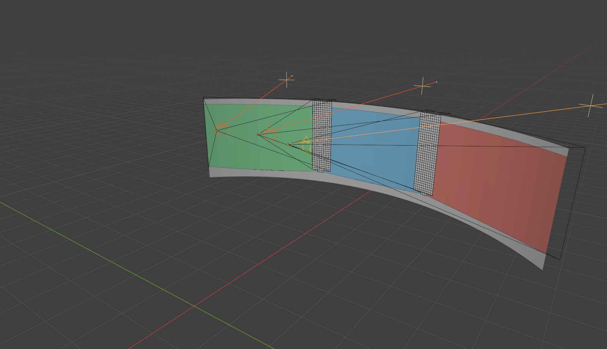

# Projection Planner

[](https://opensource.org/licenses/MIT)
[](https://www.blender.org/)

A Blender 4.2 add-on for planning ceiling-mounted projector arrays against
curved and flat walls. It answers the questions an AV design engineer actually
has to answer before ordering brackets:

*Where does each projector hang? What lens does it need? Does the image reach
the ends of the wall? How wide is the blend? How bright will it be?*



*Three 7000 lm projectors on a 12.57 m × 3 m curved wall (8 m radius, 90°
arc). Coloured areas are the sampled image footprints, white bands are the
blend zones, and the dark strip along the bottom is wall the 16:9 images do not
reach. All of it computed, not drawn by hand.*

---

## Status — read this before trusting a number

This is **v0.2**. The table below is the whole truth about what works.

### Implemented and tested

| Capability | Notes |
|---|---|
| Throw geometry | Analytic `TR = D/W`, image size, aspect, and field of view. |
| Lens shift | Vertical and horizontal, with an explicit convention and a datasheet-percentage converter. Limits are checked and warned about. |
| Curved-wall surfaces | Vertical-axis cylindrical wall segments; exact ray/cylinder intersection with arc and height bounds. |
| Image footprints | The frustum is ray-cast onto the wall on an N×N grid. Reports arc span, height, throw spread, incidence angles, and spill. |
| Projector aiming | Aim-at-target, plus a level (lens-shift) and a tilt mounting mode. |
| Array planning | Lay *N* projectors across a wall at a requested overlap. Solves numerically for the standoff distance that produces the required arc width. |
| Coverage / gaps / blend zones | Rasterised over the wall in arc-length × height. Reports lit area, dark bands, blend widths, and overlap count. |
| Brightness | Illuminance and luminance from real per-point distance and incidence. **First-order estimate — see the assumptions below.** |
| Non-destructive scene output | Generated content is owner-tagged and organised in dedicated collections. Re-plan/clear removes only add-on-owned generated objects. |

More than 200 tests run under plain CPython against the production modules,
plus a headless Blender smoke workflow. Both run in CI.

### Experimental / limited

- **Only cylindrical walls.** Flat walls work by using a large radius (there is
  a helper for this). Spheres, domes, and arbitrary meshes are not supported —
  the add-on does not ray-cast against imported geometry.
- **Brightness is an estimate, not a photometric simulation.** Every report
  states its assumptions; they are also in `core/photometry.py`. In short:
  uniform intensity across the frustum, full rated lumens, a Lambertian screen,
  **zero ambient light**, and linear addition in overlaps. Real rooms are
  dimmer. Derate deliberately.
- **Blend zones are geometry only.** The add-on tells you where images overlap
  and how wide the overlap is. It does not model the soft-edge luminance ramp a
  blending processor applies.
- **Target transforms are constrained.** Generated walls may be translated,
  but rotation or unapplied scale is rejected because the implemented surface
  is a vertical circular cylinder, not an arbitrary transformed mesh.

### Deliberately not implemented

These were claimed by earlier versions of this README and are **removed**
because they did not exist and, in some cases, are not physically meaningful.
See [ADR 0002](docs/adr/0002-removed-claims.md) for the reasoning.

- Phase synchronisation between projectors *(not a real phenomenon for
  incoherent sources — you want genlock and colour matching, which live in the
  signal chain)*
- Thermal CFD / thermal placement visualisation
- Ambient-light AI compensation
- VR/AR integration
- DWG/DXF/RVT CAD import *(use Blender's own importers, then mark the surface)*

### There is no web app

An earlier `web-projection-system/` React app duplicated this maths in
TypeScript. It has been retired — see
[ADR 0001](docs/adr/0001-canonical-architecture.md), which includes the commands
to recover it from git history. The Blender add-on is the only product here.

---

## Install

**Blender 4.2 LTS or newer.**

1. Build the Blender extension archive. Its `blender_manifest.toml` and
   `__init__.py` must be at the zip root:

   ```bash
   git clone https://github.com/Saml1211/Blender-PJ-System.git
   cd Blender-PJ-System
   blender --background --factory-startup --command extension build \
     --source-dir blender_projection_system \
     --output-filepath projection_planner.zip
   ```

2. In Blender: **Edit ▸ Preferences ▸ Get Extensions ▸ ▾ ▸ Install from
   Disk…**, then pick the zip. Enable **Projection Planner** under Add-ons if
   Blender does not enable it automatically.

If Blender reports `acquire(): cookie doesn't exist!`, the current Blender
session lost the temporary directory used by its extension-repository lock.
Quit every Blender window and retry in a fresh session; rebuilding the zip does
not repair that session-level lock error, though the archive must still pass
the validation command below.

3. Open the 3D viewport sidebar with <kbd>N</kbd> and select the
   **Projection** tab.

For development, symlink instead of copying so edits take effect on reload.
The examples use Blender `4.2`; replace that path segment with your active
Blender version when needed:

```powershell
# Windows (run as administrator)
New-Item -ItemType SymbolicLink `
  -Path "$env:APPDATA\Blender Foundation\Blender\4.2\scripts\addons\blender_projection_system" `
  -Target "$PWD\blender_projection_system"
```

```bash
# macOS
ln -s "$PWD/blender_projection_system" \
  ~/Library/Application\ Support/Blender/4.2/scripts/addons/
# Linux
ln -s "$PWD/blender_projection_system" ~/.config/blender/4.2/scripts/addons/
```

---

## Quick start — three projectors on a curved wall

This reproduces the screenshot above, and is the same sequence the CI smoke
test runs.

### 1. Create the wall

**Projection ▸ 1. Projection Target ▸ Create Curved Wall**

| Field | Value |
|---|---|
| Radius | `8 m` |
| Height | `3 m` |
| Arc | `90°` |
| Concave | ✅ (projectors sit inside the arc) |

The panel confirms **arc length 12.57 m, area 37.7 m²**. The wall is created in
the `PJ Targets` collection and set as the analysis target automatically.

### 2. Describe the projector and the mount

**Projection ▸ 2. Projectors**

| Field | Value |
|---|---|
| Throw Ratio | `1.2` |
| Aspect | `16 : 9` |
| Lumens | `7000` |
| Max Vertical Shift | `0.6` (i.e. ±120% in datasheet terms) |
| Mount Mode | **Level + Lens Shift** |
| Mount Height | `3.2 m` |
| Image Centre Above Wall Base | `1.65 m` |
| Projectors | `3` |
| Overlap | `0.15` |

> **On the lens-shift convention:** this add-on expresses shift as a fraction
> of the *full* image dimension, so `0.5` puts the optical axis on the image
> edge. Many datasheets call that same geometry "100% offset". Halve the
> datasheet number to get this field.

### 3. Plan the array

**Plan Projector Array.** You get three projectors, each hung at 3.2 m:

```
PJ_01  mount x=+1.899 y=-1.024 z=3.200   throw 5.842 m   image 4.869 × 2.739 m   shift -56.6%
PJ_02  mount x=+2.158 y=+0.000 z=3.200   throw 5.842 m   image 4.869 × 2.739 m   shift -56.6%
PJ_03  mount x=+1.899 y=+1.024 z=3.200   throw 5.842 m   image 4.869 × 2.739 m   shift -56.6%
```

### 4. Calculate coverage

**Projection ▸ 3. Analysis ▸ Calculate Coverage.** The Report panel shows:

```
Wall 'PJ_CurvedWall': 12.57 m arc x 3.00 m high (37.7 m2)
Coverage: 89.4% of wall area (33.7 m2 lit, 4.0 m2 dark)
Horizontal coverage: 100.0% of the arc; lit band 0.25-3.00 m high
Overlap: 8.7% of the wall, max 2 projector(s) on one spot
  PJ_01: arc 0.00 - 4.65 m (4.65 m wide)
  PJ_02: arc 3.96 - 8.61 m (4.65 m wide)
  PJ_03: arc 7.91 - 12.57 m (4.65 m wide)
  blend PJ_01 | PJ_02: 0.63 m (14% / 14% of image width)
  blend PJ_02 | PJ_03: 0.63 m (14% / 14% of image width)
Brightness: mean 195 nits (57.0 fL), range 145-391 nits, uniformity 0.37
```

Read the warnings — they are the useful part. This design reports that the
16:9 images leave a 0.25 m unlit strip along the bottom of a 3 m wall, and that
illuminance uniformity is 0.37 because the wall ends are struck at up to 28°.
Both are true and both are decisions for you, not errors.

**Copy Report** puts the whole thing on the clipboard for a design document.

### Reading the overlay

| Overlay | Meaning |
|---|---|
| Coloured areas | Each projector's sampled image footprint |
| White bands | Blend zones where two images overlap |
| Near-black bands | Dark gaps no projector reaches (none in this example) |
| Wireframe cones | Lens to image corners |

**Clear Analysis** removes only the `PJ Analysis` collection. Your wall and
projectors are untouched.

### Try breaking it

The tool is most useful when it says no. Set **Image Centre Above Wall Base** to `1.5 m`
and re-plan: it now reports that each projector needs −62.1% vertical shift
against a 60% lens limit, and tells you to lower the mount, raise the image
centre, or switch to tilt mounting. That warning is why the quick start uses
1.65 m.

---

## Verifying it yourself

```bash
pip install pytest ruff

ruff check blender_projection_system tests      # lint
python -m compileall -q blender_projection_system tests
pytest -v

blender --factory-startup --command extension validate blender_projection_system
```

The tests import the production modules directly — there are no mock
reimplementations of the formulas. Several anchor the curved-wall code against
textbook flat-screen results:

- `test_a_near_flat_wall_reproduces_the_throw_formula_image_size` — sampling a
  100 km-radius wall must return `W = D/TR`.
- `test_mean_illuminance_on_a_flat_wall_conserves_luminous_flux` — the sampled
  lux, averaged over a flat image, must equal `lumens / area`.
- `test_the_curved_wall_error_shrinks_as_the_radius_grows` — curvature error
  must converge monotonically to zero as the wall flattens.

### Headless Blender check

```bash
blender -b --factory-startup --python-exit-code 1 --python tests/blender_smoke.py
```

It covers repeated and duplicate registration, the end-to-end planning and
analysis operators, generated-wall synchronisation, collection ownership,
camera transforms, generated geometry, and a cross-check that the Blender
layer and `core/` return the same coverage numbers. It exits non-zero on
failure, so CI can rely on it.

---

## Architecture

```
blender_projection_system/
├── core/                 # Pure Python. Never imports bpy. All the maths.
│   ├── throw.py          #   throw ratio, image size, lens shift, frustum rays
│   ├── surfaces.py       #   cylindrical walls, ray intersection
│   ├── pose.py           #   projector placement and orientation
│   ├── footprint.py      #   frustum -> surface sampling, back-projection
│   ├── coverage.py       #   gaps, blend zones, illuminance grid
│   ├── array.py          #   multi-projector layout and standoff solve
│   └── photometry.py     #   illuminance, luminance, stated assumptions
├── properties.py         # Blender property groups
├── operators.py          # The workflow. Delegates all arithmetic to core/
├── ui.py                 # Sidebar panels
└── visualization.py      # Mesh generation for the overlays
```

The `core/` boundary is enforced by a test, not just convention: it is why the
maths is testable without Blender, and why there is exactly one implementation
of every formula.

Units are SI throughout — metres, radians, lumens, lux, candela. Angles are
radians unless a name ends in `_deg`.

---

## Contributing

See [CONTRIBUTING.md](CONTRIBUTING.md). Two rules matter most:

1. **New formulas go in `core/`, with a test that imports them.** A test that
   redefines the formula inside the test file proves nothing — that is exactly
   what v0.1 shipped.
2. **Do not claim a capability the code does not have.** If it is an estimate,
   say what it assumes.

## License

MIT — see [LICENSE](LICENSE).
