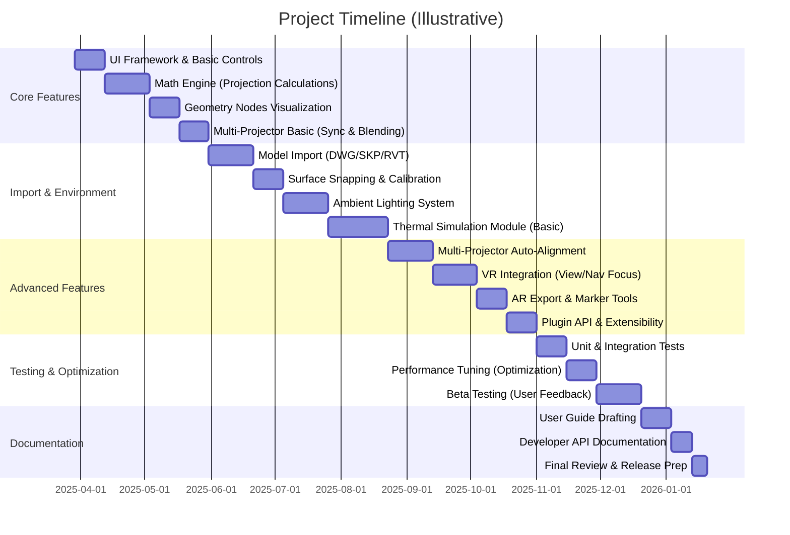

# Blender Projection Calculator Add-on PRD (Enhanced)

*(Note: This document is an enhanced version of the original PRD, incorporating refinements based on further technical feasibility analysis.)*

PRD Structure Diagram

## 1. Project Overview

### 1.1 Purpose
Develop an advanced projector simulation system within Blender that combines:
- Real-time 3D visualization using Geometry Nodes for accurate beam and image representation
- Physics-accurate projection calculations for throw distances, lens shifts, and illuminance
- Professional installation planning tools for multi-projector setups and alignment
- CAD/BIM model integration for real-world environments (architectural models, stage designs, etc.)
- **Environmental lighting simulation** to account for ambient light effects on projection quality
- **Thermal airflow visualization** to manage projector heat dispersion in venue layouts *(Note: Initial implementation will be a simplified approximation, see Sec 3.2.5 & 10)*
- **VR/AR integration** for immersive visualization and on-site augmented reality previews *(Note: Initial VR interaction capabilities may be limited, see Sec 3.4.1 & 10)*

**Target Users:** This add-on is designed for professional AV System Design Engineers across film production, architectural lighting, live events, corporate installations, and custom immersive environments. It enables these professionals to simulate projector setups in realistic 3D scenes, optimize equipment placement, and identify potential issues (like insufficient brightness under ambient light or overheating in clustered installations) before physical deployment.

### 1.2 Key Innovations vs Commercial Tools
| Feature                     | Web Calculators (Typical) | **Blender Add-on**               |
|-----------------------------|---------------------------|----------------------------------|
| **3D Visualization**        | 2D Diagrams only          | Full 3D scene with geometry nodes |
| **Surface Types**           | Flat screens only         | Curved/NURBS surfaces & imported CAD models |
| **Unit Precision**          | 1 cm increments           | 0.1 mm precision (engineering-grade) |
| **Multi-Projector Sync**    | Manual timing             | Phase-aligned refresh across units |
| **Environment Factors**     | None (ignores ambient)    | Ambient light AI for contrast planning |
| **Multi-Projector Alignment** | Manual alignment & overlap | Auto-calculation of alignment, edge blending, and overlap optimization |
| **Thermal Management**      | Not addressed             | Heat output simulation with hot/cold airflow paths (Simplified Model) |
| **VR/AR Integration**       | Not available             | VR mode for immersive design; AR export for on-site visualization |
| **Extensibility**           | Closed system             | Plugin API for third-party extensions and custom tools |

### 1.3 Terminology Glossary
| Term                   | Definition                                                                                            |
|------------------------|-------------------------------------------------------------------------------------------------------|
| **Throw Distance (D)** | Distance from the projector's lens to the screen or projection surface.                               |
| **Image Width (W)**    | Width of the projected image on the surface (height = W/AR for a given aspect ratio).                 |
| **Throw Ratio**        | The ratio of throw distance to image width (D/W), indicating how large an image a projector throws from a given distance. |
| **Aspect Ratio (AR)**  | Ratio of image width to height (e.g., 16:9). Determines image height as *Height = Width / AR*.        |
| **Lens Shift**         | Offset of the projected image vertically or horizontally relative to the projector's optical axis, usually expressed as a percentage of image dimensions. |
| **Keystone**           | Distortion effect (usually trapezoidal) caused when a projector is not perpendicular to the screen. Keystone correction aims to rectify this. |
| **Edge Blending**      | Technique of overlapping projections from multiple projectors with a gradual intensity fall-off (blend) at edges to create a seamless combined image. |
| **Lumens (lm)**        | Unit of luminous flux. Projector brightness is often rated in lumens (total light output).            |
| **Lux (lx)**           | Unit of illuminance (lumens per square meter). Used to measure light on the projection surface (e.g., ambient light level). |
| **BTU/h**              | British Thermal Units per hour, a unit of heat output. Used to quantify projector heat generation (e.g., 1,315 BTU/h). |
| **Geometry Nodes**     | Blender's node-based system for procedural geometry and effects. Used here to visualize projection cones and other dynamic geometry. |
| **BIM (IFC)**          | Building Information Modeling format (Industry Foundation Classes). A 3D format for building data, supported for importing architectural environments. |
| **VR (Virtual Reality)**  | Immersive visualization through VR headsets, allowing users to "step inside" the projection setup in 3D. |
| **AR (Augmented Reality)** | Overlay of digital content (projector models, beams) onto the real world via AR devices, enabling on-site visualization of the planned setup. |
| **Phase (Sync)**       | In multi-projector context, refers to the synchronization of projector refresh or shutter cycles. Maintaining phase alignment (<1 ms jitter) prevents flicker when combining images. |

## 2. Core Technical Architecture

```mermaid
graph TD
    A[Blender UI] --> B[Python API & Add-on Core]
    B --> C[Calculation Engine]
    C --> D[Geometry Nodes (Visualizations)]
    C --> E[Shader System (Materials)]
    D --> F[3D Scene Visualization]
    E --> G[Material & Lighting Response]
    B --> H[Model Import Handlers]
    H --> I[Metric/Imperial Conversion]
    H --> J[Surface Snapping Tools]
    B --> K[Plugin Extensions API]
    A --> L[VR/AR Interface]
```

**Subsystem Overview:** The system is built as a Blender add-on in Python, leveraging Blender's API:
- **Blender UI (A):** Custom panels, toolbars, and viewport overlays for user interaction. This includes control panels for projection settings, environment effects, and immersive (VR/AR) toggles.
- **Python API & Add-on Core (B):** The heart of the add-on, managing user input, calling Blender ops, updating the scene, and coordinating between subsystems. It exposes a plugin interface (K) for extensibility, allowing third-party modules to register new calculations or support additional hardware. *(Note: Python performance for real-time calculations is a key consideration, see Sec 10)*.
- **Calculation Engine (C):** Performs all physics and math computations. It calculates projection geometry, illumination, alignment, and environmental lighting impact and thermal distribution (simplified). It ensures **bidirectional parameter linking** (e.g., adjusting throw distance updates image size and vice versa) and handles multi-projector optimization algorithms.
- **Geometry Nodes (D):** Procedurally generates visualization geometry such as projection cones (volumetric frustums), field-of-view extents, and visualization aids for airflow paths (for thermal simulation) in real-time. This allows the 3D scene (F) to update immediately as parameters change. *(Note: Geometry Nodes primarily handle visualization based on Python calculations, not complex simulation logic itself.)*
- **Shader System (E):** Manages materials and shading for projection beams and surfaces. It is responsible for brightness heatmaps on surfaces, edge blending gradients, and visualizing ambient light vs projector light contrast. It interacts with Blender's lighting engine to simulate realistic illumination (G).
- **3D Scene Visualization (F):** The actual objects in the Blender scene (projector models, projected image planes, etc.). The scene is updated via geometry nodes and Python to reflect throw distances, orientations, and overlaps. This includes VR camera setups for immersive viewing and AR markers/exports.
- **Material & Lighting Response (G):** Handles how surfaces react to projected light and ambient light. For example, a screen material might have adjustable gain, and an ambient light setting affects its appearance. Also used for visual feedback like showing a dimmer image under high ambient lux.
- **Model Import Handlers (H):** Import pipeline supporting various file formats (e.g., DWG, SKP, RVT, IFC). This component calls external libraries or Blender importers and then standardizes units and orientation. It coordinates with conversion utilities (I) to ensure imported models match the scene's unit system and scale.
- **Metric/Imperial Conversion (I):** Utility module ensuring all internal calculations use a consistent unit system (metric base) and providing on-the-fly conversion for UI display (e.g., to feet/inches if needed). Uses high-precision decimal arithmetic to avoid drift.
- **Surface Snapping Tools (J):** Tools to assist in attaching projectors and projected images to irregular surfaces. It uses Blender's snapping (projecting points onto surfaces) to allow a projector to aim exactly at a selected face or follow curved walls. This helps define projection targets in complex geometry.
- **Plugin Extensions API (K):** A defined interface allowing third-party developers to extend the add-on. For example, a plugin could add support for a new projector hardware with custom lens profiles or integrate an external calibration device. The core exposes hooks (Python classes and events) where plugins can register, such as after calculation update (to modify results) or on scene load (to add new objects). The architecture isolates these plugins in a sandboxed manner to maintain stability.
- **VR/AR Interface (L):** Integration point for immersive technology. For VR, this ties into Blender's VR session system (OpenXR) to allow the user to enter a VR view of the current scene. For AR, this interface works with exporters or external AR frameworks to position virtual projectors in real-world coordinates (e.g., exporting the scene to a USDZ or glTF format for viewing through an AR device on-site). The interface ensures that what the user sees in VR/AR is kept in sync with the design scene (projector placement, orientation, and lighting conditions). *(Note: Advanced VR interaction capabilities are dependent on Blender API evolution, see Sec 10).*

The architecture is designed for modularity. Each subsystem can be updated or replaced with minimal impact on others (e.g., one can integrate a C++ acceleration module for heavy computations if Python performance is a bottleneck). The plugin architecture (K) and VR/AR module (L) illustrate the system's extensibility beyond its core features, ensuring longevity and adaptability for emerging needs.

## 3. Functional Requirements

### 3.1 Core Projection System
1.  **Parametric Relationships**
    -   Maintain dynamic, bidirectional relationships between projection parameters. Changing throw distance, image size, or throw ratio updates the others in real-time using consistent formulas.
    -   Implement fundamental equations in code:
        ```python
        def calculate_throw_ratio(distance, image_width):
            # Avoid division by zero if image_width is very small or zero
            if image_width < 1e-6: return float('inf') 
            return distance / image_width

        # Example usage: adjusting one parameter updates others
        projector.throw_ratio = calculate_throw_ratio(projector.distance, projector.image_width)
        # Avoid division by zero for aspect ratio
        if projector.aspect_ratio > 1e-6:
             projector.image_height = projector.image_width / projector.aspect_ratio 
        else:
             projector.image_height = 0 # Or handle error appropriately
        ```
    -   **Dynamic Constraints:** If certain attributes are locked (e.g., aspect ratio is locked or lens zoom is fixed), the system adjusts other variables within valid ranges.
        ```python
        if aspect_locked and projector.aspect_ratio > 1e-6:
            # Enforce height based on width and aspect ratio
            projector.image_height = projector.image_width / projector.aspect_ratio
        if zoom_fixed and projector.image_width > 1e-6:
            # Example dependency, ensure image_width is valid
            projector.distance = projector.lens_zoom * projector.image_width  
        ```
    -   **Example:** If a user sets a desired image width of 4.0 m and the projector's throw ratio is locked at 1.5, the system automatically computes the required throw distance as 6.0 m. Conversely, moving the projector to 5.0 m from the screen would update the image width to ~3.33 m to maintain the throw ratio.

2.  **Multi-Projector Management**
    -   Manage multiple projectors in a single scene with synchronized settings and intelligent balancing. This includes keeping refresh cycles aligned and balancing brightness overlaps.
    -   **Phase Synchronization Algorithm:** All projectors should ideally refresh in unison to avoid flicker in overlapping regions. A small random phase jitter can be introduced to reduce moiré effects while keeping within a tight tolerance (e.g., ±0.01).
        ```python
        import random
        def sync_projectors(projectors):
            if not projectors: return # Handle empty list
            base_phase = projectors[0].phase
            for p in projectors[1:]:
                p.phase = base_phase + random.uniform(-0.01, 0.01)  # tiny phase offset in seconds
        ```
        *\*This ensures any two projectors differ by at most ~0.02s in phase (avoiding perceptible flicker) and meets the <1ms jitter requirement for 10 units.*
    -   **Auto-Alignment Algorithm:** Automatically calculate the optimal positioning and lens shift for multiple projectors to cover a single large screen or blend into a single image. The algorithm accounts for overlap regions and attempts to equalize brightness across them.
        ```python
        def auto_align_projectors(projectors, target_surface):
            # Assume projectors aim at same target surface
            if not projectors: return # Handle empty list
            layout = plan_layout(len(projectors), target_surface)
            if not layout: return # Handle layout planning failure
            for proj, pose in zip(projectors, layout):
                 if pose: # Ensure pose data is valid
                     proj.location, proj.rotation = pose  # position/rotate each projector as per plan
                 else:
                     # Log error or skip this projector if layout data is missing
                     print(f"Warning: Missing layout pose for projector {proj.name}")
                     continue 
            adjust_lens_shifts(projectors, target_surface)
            optimize_overlap_blend(projectors)
        ```
        *\*Pseudocode:* `plan_layout` might arrange projectors (e.g., in a grid or circle) depending on target surface dimensions. `adjust_lens_shifts` fine-tunes each projector's lens shift to center its image on its assigned region of the surface. `optimize_overlap_blend` calculates overlap areas and sets edge blending parameters so that where images overlap, the combined brightness is uniform. The result is a recommended placement layout and settings that the user can further fine-tune.
    -   **Smart Layout Suggestions:** Provide automatic suggestions for multi-projector layouts. For instance, if a user needs to cover a wide stage with two projectors, the add-on can suggest side-by-side placement with a certain overlap percentage. Suggestions consider throw distance limits, lens shift capabilities, and room constraints (e.g., avoiding pillars). This feature uses simple heuristics (like symmetric placement for two projectors, grid layouts for 4 projectors, etc.) and presents the user with options (e.g., stacked vs side-by-side) in the UI.
    -   **Jitter Monitoring:** Continuously monitor synchronization jitter and alignment drift between projectors. The system tracks parameters like phase difference and any timing offsets. If any projector falls out of sync (e.g., due to a user altering a setting or a performance lag), an alert overlay is shown (e.g., a red indicator next to that projector). Jitter monitoring also logs the variance in frame timings. *(Note: Real-time monitoring performance impact needs careful management, see Sec 6 & 10).*
        ```python
        def monitor_jitter(projectors):
            if len(projectors) < 2: return # No jitter to monitor with less than 2 projectors
            phases = [p.phase for p in projectors]
            max_diff = max(phases) - min(phases)
            if max_diff > 0.002:  # 2 ms threshold
                display_warning("Projector sync jitter exceeds 2ms")
        ```
        This function would be called periodically (potentially in a background thread) to ensure multi-projector synchronization remains within acceptable limits. It helps maintain <1ms jitter across 10 units by warning the user to recalibrate or reset sync if needed.

3.  **Edge Blending & Warping** (Part of multi-projector imaging)
    -   Implement edge blending between overlapping projector images. Use a cosine fall-off function to ensure a smooth transition where two projections overlap, preventing bright seams. For each projector, the edge blend alpha (`α`) at a given pixel *x* is calculated based on its distance from the center of the overlap region:
        ```math
        \alpha(x) = \frac{1}{2}\Big(1 + \cos\big(\pi \frac{x - x_0}{w}\big)\Big)
        ```
        where *x₀* is the midpoint of the blend region and *w* is the width of the blend zone. At the center of overlap (*x = x₀*), α = 1 (projector contributes full intensity); at the edge of the blend zone, α tapers to 0, allowing the adjacent projector to take over. The add-on uses this function to modulate pixel intensities on overlapping areas in real-time (via shaders), creating a seamless image blend.
    -   **Geometry Warping:** Support keystone correction and arbitrary warping (for projection mapping onto non-flat surfaces). While Blender's UV projection modifier is used for basic keystone (see Technical Specs), more complex warping can be achieved by driving a mesh (or UV map) via the calculation engine. The requirement is that users can adjust corner points of the projected image to align with physical markers, and the system will warp the image accordingly.

4.  **Interactive Updates**
    -   All core calculations should update in near real-time as users drag sliders or move objects. For example, if a user interactively moves a projector in the 3D viewport, the add-on should update throw distance, recalc image size, and redraw the projection cone and brightness heatmap without noticeable lag (see Performance Requirements for targets). Bidirectional coupling means the user can also adjust numeric fields (e.g., desired illuminance) and the scene objects will move (e.g., projector moves farther back to achieve that illuminance on a larger area). *(Note: Performance for complex scenes or features like thermal heatmaps is a constraint, see Sec 6 & 10).*

### 3.2 Environment System
1.  **Room Generation**
    -   Provide a quick way to generate a prototypical room or venue for testing projections. By default, a parametric room (e.g., a simple rectangular room or cube) can be added with one click, to serve as a starting environment.
        ```python
        import bpy # Ensure bpy is imported
        # Create a simple 2x2x2 meter cube room centered at origin
        bpy.ops.mesh.primitive_cube_add(size=2, calc_uvs=True, enter_editmode=False)
        # Check if an object was actually created and selected
        if bpy.context.active_object:
             room = bpy.context.active_object
             room.name = "Default Room"
        else:
             print("Error: Could not create default room.") # Basic error handling
        ```
        The add-on will typically scale this cube and flip its normals to create an inward-facing room (so projection hits the interior walls). Users can adjust room dimensions (length, width, height) via sliders, and the geometry updates accordingly.
    -   **Unlink Capability:** If the user wants to customize the generated room (e.g., edit vertices to add a stage), the add-on allows making the room geometry independent from the generator so it can be edited freely.
        ```python
        # Ensure there are selected objects before attempting operation
        if bpy.context.selected_objects:
             bpy.ops.object.make_single_user(type='SELECTED_OBJECTS')
        else:
             print("Warning: No object selected to unlink.")
        ```
        This ensures the procedural link is broken and the user has a unique mesh to modify without the add-on overwriting their changes.

2.  **Model Import**
    -   Support importing external environment models from industry-standard formats so that projectors can be placed in an accurate representation of the real venue or set. Supported formats include:
        -   `.dwg` (AutoCAD drawings, via an external Teigha-based converter if needed)
        -   `.skp` (SketchUp models)
        -   `.rvt` (Revit BIM, via IFC or dedicated converter)
        -   `.ifc` (Industry Foundation Classes, for BIM models directly)
        -   Plus common formats like `.obj`, `.fbx` (leveraging Blender's native importers)
    -   After import, automatically scale and unit-normalize the model to match Blender's unit system (meters by default). For example, many CAD models in millimeters are scaled down by 0.001.
        ```python
        bpy.context.scene.unit_settings.system = 'METRIC'
        # Check if there are selected objects after import
        if bpy.context.selected_objects:
             obj = bpy.context.selected_objects[0] # Assume first selected is the imported model
             # Example unit detection logic (replace with actual metadata check)
             import_units = 'MM' # Placeholder - should be detected from file or user input
             if import_units == 'MM':
                 obj.scale = (0.001, 0.001, 0.001)  # Convert mm to m
             # Add more unit conversions as needed (e.g., 'INCHES', 'FEET')
             bpy.ops.object.transform_apply(location=False, rotation=False, scale=True) # Apply scale
        else:
             print("Warning: No object selected after import for scaling.")
        ```
        The add-on reads metadata from IFC/Revit files if available to interpret units and positioning. It also offers an alignment tool to drop the imported model so that floor planes align with Blender's ground (z=0). *(Note: Performance of importing very large models is a consideration, see Sec 10).*
    -   **Surface Calibration:** Ensure that imported surfaces intended for projection (e.g., screens, walls) have correct real-world dimensions. The user can select a known-length edge and input its real measurement to have the model uniformly scale if needed (a common step when unit mismatches occur in imported CAD).

3.  **Surface Definition**
    -   Allow users to designate which surfaces in the scene are projection targets. This could be a wall, a curved screen, a building facade, etc. Once defined, those surfaces can receive projected textures via UV Project modifier for visualization.
    -   **Snapping Logic:** Provide a tool to snap projectors or projector aim points directly onto a surface. For instance, a user can pick a wall and the projector will rotate to face it directly (normal alignment). Blender's snapping settings are used under the hood:
        ```python
        # Ensure snapping settings are available in the context
        if hasattr(bpy.context.scene.tool_settings, 'snap_elements'):
             bpy.context.scene.tool_settings.snap_elements = {'FACE'}
             bpy.context.scene.tool_settings.use_snap_project = True  # project elements onto surface
             bpy.context.scene.tool_settings.use_snap_align_rotation = True # Align rotation to surface normal
        else:
             print("Warning: Snapping settings not available in current context.")
        ```
        With this enabled, moving a projector will cause it to stick to surfaces if moved near, ensuring the projector is exactly at the wall or ceiling if intended (useful for mounting). Similarly, one can snap an "impact point" on a surface to define where the projector's center ray should hit.
    -   **Curved Surface Support:** For curved screens or domes, the add-on can subdivide the surface mesh and ensure that UV projection or ray intersection is calculated at a fine enough resolution to accurately place the image. It uses ray-casting from the projector to the surface to find intersection points, which define the four corners of the projected image on that surface. These corner points are then used to set the UV Project modifier so that the projector's view texture maps correctly even on a curved geometry.

4.  **Environmental Lighting**
    -   Simulate the effect of ambient and direct lighting in the environment on projection visibility. Users can specify ambient light levels in the room (in lux, i.e., how much light is falling on surfaces from room lights or daylight). The system uses this to calculate contrast and required projector brightness.
    -   **Ambient Light Setting:** A control for ambient illumination (e.g., 50 lux for a dim room, 300 lux for a bright office). This value influences the brightness heatmap and on-screen image preview by washing it out according to the physics of light addition. The add-on will internally adjust the material representing the projected image: a brighter ambient means the image material is combined with a grey base equal to ambient intensity.
    -   **Luminance and Contrast Calculation:** The calculation engine compares projector illuminance vs ambient illuminance on the screen to give a contrast ratio. For example, if ambient light on the screen is 50 lux and the projector provides 500 lux, the contrast ratio is 10:1. The tool can display this ratio and even warn if it falls below recommended values (e.g., <3:1 is usually considered poor in bright environments).
    -   **Required Brightness Estimator:** Given an ambient light level and a desired contrast, the add-on can estimate the necessary projector lumen output (taking screen size into account).
        ```python
        def required_projector_lumens(screen_area, ambient_lux, desired_contrast):
            # Validate inputs
            if screen_area <= 0 or ambient_lux < 0 or desired_contrast <= 0:
                 print("Warning: Invalid input for lumen estimation.")
                 return 0 
            # ambient_lux applies to the screen area
            ambient_lumens_on_screen = ambient_lux * screen_area
            # To achieve desired contrast, projector light must overcome ambient
            # Required projector illuminance = ambient_lux * desired_contrast
            # Required projector lumens = Required projector illuminance * screen_area
            required_lumens = (ambient_lux * desired_contrast) * screen_area
            # Practical adjustment: projector lumens rating != lumens on screen (efficiency loss)
            # Let's assume a typical efficiency factor (e.g., 0.7)
            efficiency_factor = 0.7 
            return required_lumens / efficiency_factor if efficiency_factor > 0 else float('inf')
        ```
        For instance, on a 3 m² screen with 100 lux ambient and 15:1 contrast goal, required on-screen lumens is 100 * 15 * 3 = 4500 lm. Accounting for efficiency (e.g., 70%), the suggested projector rating would be ~6430 lumens. This helps users pick the right projector.
    -   **Real-time Lighting Effects:** If the user adds actual Blender lights (e.g., point lights, sun lamps for windows), the add-on can optionally sample illumination at the screen surface to derive ambient lux instead of a fixed user input. This uses Blender's irradiance probes or light sampling in the viewport to account for complex lighting (like multiple spotlights). It then feeds that value into the contrast calculation dynamically.
    -   **Ambient Light Visualization:** The viewport overlay can include an ambient light overlay (a subtle flat illumination on all surfaces). When toggled, the user sees the projected image as it would appear under the given ambient light — i.e., blacks are raised to grey if the room is not dark. This leverages the material shader (G in architecture) to add an ambient term to the projection material.

5.  **Thermal Management Simulation**
    -   Introduce a simulation of projector heat output and airflow to help plan for thermal management in installations. Each projector in the system has attributes like heat output (in BTU/h or watts) and cooling method (air-cooled with fans, liquid cooling, etc.). The add-on uses these to visualize how heat accumulates and disperses in the room. *(Note: This feature provides a simplified approximation, not a high-fidelity CFD. Accuracy and performance depend on the complexity of the scene and simulation settings. See Sec 10 for risks).*
    -   **Airflow Paths:** For air-cooled projectors, the add-on represents hot air exhaust and cool air intake as colored cones or arrows in the 3D scene using Geometry Nodes for visualization based on Python calculations. For example, a red cone emanating from the projector's exhaust port indicates hot air flow, and a blue shape at the intake indicates where cool air is drawn in. These can be simple empties or particle systems that show direction and relative volume of airflow. Users can see if, for instance, one projector's hot exhaust is blowing onto another projector's intake (undesirable).
    -   **Heat Map Overlay:** In large installations, pockets of hot air can form near the ceiling or in enclosed spaces. The add-on provides a "thermal heat map" overlay mode for the room. This might be a volumetric representation (e.g., a semi-transparent grid or fog that gets redder in hot zones), visualized using Geometry Nodes or shaders based on the underlying simulation data.
    -   **Simplified Thermal Calculation:** A basic model divides the room into a 3D grid and increases cell temperatures based on distance from each projector and any obstructions (surfaces can block or deflect airflow). Without doing a full CFD, we approximate: temperature rise ∆T in a cell = (sum of projector heat contributions) * some factor based on distance and ventilation. This calculation runs in Python, potentially in a background thread to avoid blocking the UI (see Sec 6 Performance).
        ```python
        # Placeholder: Assume room_grid and projectors are defined
        # Example logic within the calculation step
        ambient_temp = 20.0 # Example ambient room temperature in Celsius
        cooling_factor = 0.1 # Example cooling factor per update step
        
        for projector in projectors:
            heat_src = projector.heat_output # in watts (needs conversion if BTU/h)
            proj_loc = projector.location
            for cell in room_grid.cells:
                # Calculate distance safely
                dist_vec = cell.center - proj_loc
                dist_sq = dist_vec.length_squared
                # Avoid division by zero and limit effect at very close range
                dist_sq_safe = max(dist_sq, 0.1) # Minimum distance squared 
                # Simple inverse square falloff
                heat_contribution = heat_src / (dist_sq_safe + 1) 
                cell.temperature += heat_contribution 
                
        # After populating heat from all sources, adjust for cooling/ambient baseline
        for cell in room_grid.cells:
             # Temperature decreases towards ambient based on cooling factor
             cell.temperature = max(ambient_temp, cell.temperature - (cell.temperature - ambient_temp) * cooling_factor) 
        ```
        The above pseudocode shows adding heat to each cell with an inverse-square falloff. It then adjusts temperature towards ambient based on a cooling factor. The result is a rough temperature distribution, visualized via Geometry Nodes or shaders.
    -   **Thermal Alerts:** If any projector is in a location where the ambient temperature is predicted to exceed its operating limit (e.g., a projector that runs hot placed in a ceiling nook with poor ventilation), the system can flag this based on the simplified simulation results. For example, if the simulated local temperature around Projector A exceeds 35°C, an alert is shown in the UI suggesting better cooling or relocation.
    -   **Interactive Toggling:** The thermal simulation can be toggled on/off, since it may be performance-heavy. A "Thermal Simulation" checkbox in the UI starts or pauses the heat dispersion calculation and visualization. When on, it updates periodically (e.g., every few seconds, not necessarily every frame) to balance responsiveness and computational load. The user can also step through time to see how heat builds up (e.g., after 1 hour of projector operation).
    -   **Fan and Vent Customization:** For advanced users, each projector can have settings like CFM (cubic feet per minute of airflow) for its fans, and directional control for exhaust. The add-on can allow editing these and will adjust the visualization accordingly (e.g., a stronger fan = longer heat plume). While these details are mainly for visualization, they help AV engineers ensure projectors won't cause overheating in clustered installations.

### 3.3 Unit System
1.  **Metric Foundation**
    -   The system will use Metric units internally (meters, square meters, lux, etc.) for all calculations. This provides consistency and precision, as these are standard in scientific calculations.
    -   All distances, areas, and light values are stored and computed in metric (SI units). For example, throw distance in meters, screen size in meters, luminous flux in lumens, illuminance in lux, temperature in °C. The base unit definitions are set at initialization:
        ```python
        # Example: Setting within the add-on's preferences or initialization
        # addon_prefs = context.preferences.addons[__name__].preferences
        # addon_prefs.base_unit = 'METERS'
        # addon_prefs.display_precision = 3 
        base_unit = 'METERS' # Define default base unit
        display_precision = 3  # e.g., distances shown to 0.001 m
        ```
    -   Using a high precision (0.1 mm or 3 decimal places in meters) ensures that even very fine adjustments (such as moving a projector a few millimeters) are captured, which can be important in edge cases like short-throw projectors or small room setups.

2.  **Imperial Conversion**
    -   Support on-the-fly conversion to imperial units (feet, inches, foot-candles for illuminance, etc.) for users in regions or industries that require it. The user can toggle the unit system in the UI, and all displayed values will update accordingly, while internal values remain in metric to avoid rounding errors.
    -   Functions for unit conversion are provided:
        ```python
        # Conversion factors (consider defining as constants)
        METERS_TO_FEET = 3.28084
        METERS_TO_INCHES = 39.3701
        LUX_TO_FOOTCANDLES = 1 / 10.764

        def to_feet(meters):
            return meters * METERS_TO_FEET
        def to_inches(meters):
            return meters * METERS_TO_INCHES
        def to_footcandles(lux):
             # Handle potential division by zero if LUX_TO_FOOTCANDLES is calculated incorrectly
             if abs(LUX_TO_FOOTCANDLES) < 1e-9: return float('inf') 
             return lux * LUX_TO_FOOTCANDLES # Corrected: multiply by factor
        ```
        These ensure quick conversion for display. For example, if the throw distance is 3.5 m, the UI will show 11.48 ft. Similarly, an ambient light of 300 lux can be shown as ~27.9 foot-candles.
    -   **Unit Consistency:** When the user inputs a value in a field, the system interprets it according to the current unit setting. If the unit system is later changed, the value is converted. All documentation and labels clearly indicate units (e.g., "Throw Distance (m)" or "(ft)"). This avoids confusion in collaborative environments where some team members think in metric and others in imperial.
    -   The add-on uses Python's `decimal.Decimal` for critical calculations (like cumulative unit conversions) to prevent floating-point drift, especially when converting back and forth between systems repeatedly.

### 3.4 Extended Reality (XR) Integration
1.  **Virtual Reality Mode**
    -   Enable users to experience the projection setup in virtual reality. With one click (or button press), the system enters a VR mode leveraging Blender's VR support (built on OpenXR). In VR mode, the user can wear a VR headset to literally walk around in the virtual venue, looking at projector beams, screen content, and even heat plumes in 3D. This immersive perspective is invaluable for verifying sightlines (e.g., ensuring projectors are not blinding the audience) and understanding scale.
    -   The add-on will provide a *VR Mode Toggle* in the UI. When activated, it will prepare the scene for VR: ensure the projection beams and overlays are visible in the VR view and start the VR session.
        ```python
        # Check if VR is available/enabled in Blender preferences
        # vr_available = context.window_manager.xr_session_state != 'NONE' # Example check
        vr_mode_enabled = True # Assume user clicked toggle
        if vr_mode_enabled: # and vr_available: # Add check if needed
             try:
                 bpy.ops.wm.xr_session_toggle()  # Start or stop the VR session
             except RuntimeError as e:
                 print(f"Error toggling VR session: {e}") # Handle case where VR fails to start
        ```
        By default, the VR view will start from the current active camera or a special "VR camera" that the add-on positions at human eye height at the center of the scene. The user can teleport or move in VR to inspect different angles.
    -   **VR Interaction:** *(Note: Advanced VR interaction is a high-risk feature due to current Blender API limitations. Initial focus will be on stable viewing and navigation. Controller-based object manipulation may be deferred or simplified.)* In VR, the user might use controllers for basic navigation (teleportation) and potentially simple selection (pointing at objects). The feasibility of mapping complex interactions (like grabbing and repositioning projectors or adjusting settings via VR controllers) depends heavily on the evolution of Blender's VR/OpenXR API for addons.
    -   **Use Cases:** In film or large venue planning, the designer can stand on the virtual stage to see how the projections look from the performers' point of view. In a museum exhibit design, the engineer can check in VR that projectors are hidden from visitor sightlines. The VR mode helps communicate the design to stakeholders by giving them an interactive walkthrough.

2.  **Augmented Reality Integration**
    -   Provide tools to bring the simulation into AR for on-site validation. The add-on can export the projection setup (projector models, aimed surfaces, even the frustum of projection) to formats suitable for AR applications. For instance, a user could export to USDZ (for iOS AR QuickLook) or glTF, which preserves geometry and basic materials. The AR model includes markers or representations of where projections hit surfaces.
        ```python
        # Example using Blender's built-in exporter
        output_filepath = "proj_setup.glb"
        try:
             # Ensure necessary export options are set
             bpy.ops.export_scene.gltf(filepath=output_filepath, 
                                      export_format='GLB', # Use GLB for single file
                                      use_selection=False, # Export relevant scene parts, not just selection
                                      export_apply=True) # Apply modifiers
        except Exception as e:
             print(f"Error exporting GLTF for AR: {e}")
        ```
        The above example exports the scene (or relevant parts) to a GLB file which can be loaded into an AR viewer.
    -   The add-on also supports printing or displaying AR markers: e.g., it can generate a QR code or tracker image that corresponds to the origin of the Blender scene. Placing that printed marker in the real venue allows an AR app to align the virtual model to the real world. This way, an engineer on-site can use a tablet camera and see a holographic overlay of the planned projectors and projection outlines in the actual room, correctly scaled and positioned.
    -   **Live AR Sync (Future Extension):** With a suitable AR device connected, the add-on could live-sync the Blender scene to the AR view. For example, using an AR headset (like HoloLens or an iPad), as the designer moves a projector in Blender, the AR overlay moves accordingly. This is envisioned through network messages or by Blender acting as an AR server (this may be beyond MVP, but the architecture allows adding this via the plugin interface and external AR libraries).
    -   **Safety and Practicality:** AR integration is targeted at verification rather than control. It helps answer questions like "If I install the projector where planned, will it clear the ceiling beam and hit the screen fully?" by visualizing it in place. This feature appeals to architects and installation teams who can stand in the real space and see the outcome before any equipment is mounted.

## 4. Technical Specifications

### 4.1 Mathematical Models

**Projection Geometry:** The core geometric relationships governing projection are as follows:
```math
\begin{aligned}
&\text{Throw Ratio (TR)} = \frac{D}{W}, \quad \text{where $D$ = throw distance, $W$ = image width} \\
&\text{Image Height} = \frac{W}{AR}, \quad \text{with $AR$ = aspect ratio (width/height)} \\
&\text{Coverage Area} = \pi \,[D \cdot \tan(\frac{\theta}{2})]^{2}, \quad \text{for a circular coverage footprint with full angle $\theta$}
\end{aligned}
```
-   The throw ratio relates how far the projector is to how wide an image it casts. For example, if *D* = 6 m and *W* = 3 m, then *TR* = 2.0 (meaning the projector needs 2 m of distance for every 1 m of image width).
-   Image height is derived from width and aspect ratio. For a 16:9 aspect, if width = 4 m, height = 4/1.78 ≈ 2.25 m. This is calculated on the fly to maintain the correct aspect.
-   Coverage area assumes the projection spreads out in a cone. If the projector's lens has a field-of-view of *θ* (in radians for calculation), at distance *D* the radius of the light circle = D * tan(θ/2). The formula yields the area of that circle. *Example:* For θ = 60° (≈1.047 rad) and D = 5 m, radius = 5 * tan(0.524) ≈ 2.88 m, so coverage area ≈ 26.1 m². (This is a simplification; actual projected shape may be rectangular if aspect ratio is considered, in which case coverage would be W×H, but the circular approximation is useful for certain calculations like light spill on a floor.)

**Optical Physics (Illuminance and Attenuation):**
The brightness of the projected light on the surface (illuminance in lux) depends on projector luminous intensity, distance, angle, and any atmospheric or lens effects:
```math
E_v(\theta, D) = \frac{I \cdot \cos^4(\theta) \, e^{-k D}}{D^2} \quad \text{(in lux)}
```
-   *I* is the light intensity of the projector (in lumens per steradian, related to its lumen output and lens focus). The term $\frac{I}{D^2}$ represents the inverse-square law (brightness falls off with square of distance).
-   $\cos^4(\theta)$ is a factor from the **cosine fourth power law** of illumination, accounting for the fact that at off-axis angles θ, the effective illuminance on the image plane is reduced (due to both projection angle and lens vignetting). This means the corners of the image (larger θ) get less light than the center. The add-on uses this in the shader to dim the image towards extreme lens angles, matching real projector behavior.
-   $e^{-k D}$ accounts for atmospheric attenuation (optional, with k being an extinction coefficient per unit distance). For clean indoor air, k might be very small (nearly 0, negligible attenuation). In dusty outdoor scenarios, k would be higher. The user can input an atmospheric clarity setting which sets k. For example, k = 0.02 m⁻¹ might represent slight fog, causing a noticeable drop at long distances. If not using exponential, an equivalent dB drop per distance can be used (the original model used $10^{-0.4m}$ which implies a certain decibel drop per meter). In clear indoor conditions, we effectively set k = 0 (or m = 0 in the original formula), simplifying to pure inverse-square and cos⁴ law.
-   **Example:** If a projector has an output such that I = 1000 lumens/sr, at 5 m directly on-axis (θ=0), $E_v = 1000/25 = 40$ lux. At an off-axis point where θ=30° (cos^4(30°) ≈ 0.75) and distance maybe slightly more, the illuminance might drop to around 30 lux, and even lower if slight fog is considered. The system can overlay an *illuminance heatmap* on the image to show these variations.

**Edge Blending Function:** (See Functional Req. 3.1 for context)
We use a cosine blend function α(x) to modulate overlapping images. The function ensures smooth blending from 1 to 0 across the blend region. This is implemented in the fragment shader for the projected texture or via geometry nodes weight:
```math
\alpha(x) = \frac{1}{2}\Big(1 + \cos\big(\pi \frac{x - x_0}{w}\big)\Big), \; x_0 \pm w/2 \text{ defines blend region center and width.} 
```
In practice, each projector has its unique α for the overlap zone, and the final pixel color = α * Image_A + (1-α) * Image_B for a two-projector overlap (extended to multiple projectors as needed). This formula yields α=1 at the center of its image region and α=0 at the far edge of the blend region, creating a half-cosine falloff. The add-on might allow users to adjust the blend curve if needed (for instance, gamma correction or using different blend profiles, but cosine is a good default).

**Thermal Physics (Heat Dissipation):**
For the thermal simulation, while a full CFD is out of scope, we use simplified physics: treat each projector as a point heat source. The heat equation in steady state (ignoring convection details) could be simplified to an inverse-square dispersion for far fields. The add-on's internal model raises cell temperatures proportional to $\frac{P}{4 \pi r^2}$ (point source heat distribution) moderated by a room ventilation coefficient. We applied this in the code snippet above in Functional Req. 3.2.5. Additionally, we might use principles of fluid dynamics qualitatively: hot air rises (so heat contributions to cells higher than the projector are slightly amplified to simulate rising plumes), and if the user specifies an airflow direction, we bias the heat distribution in that direction. *(Note: The accuracy of this simplified model is limited; it serves primarily as a qualitative indicator of potential hot spots. See Sec 10).*

All mathematical formulas are validated against industry standards and common projection references. For example, throw ratio and aspect calculations align with projector datasheets, and the illuminance calculations align with photometric planning guides (taking into account lens and distance). The use of cos⁴ is a standard in optics for vignetting, and edge blending curves are standard practice in multi-projector systems. These formulas will be documented in the developer guide with derivations and source references where applicable.

### 4.2 Geometry Nodes & Shader Setup

**Projection Cone Generation:** Using Blender's Geometry Nodes, the add-on generates a mesh for the light cone (frustum) representing the projector's field of view. This cone updates as parameters change. The node setup might pass the throw distance and field of view angle into a cone generator node group. Pseudo-connections:
```python
# Example: Connecting parameters to a Geometry Node group
# Assume 'node_group' is the Geometry Node group on the visualization object
# Assume 'param_node' somehow provides the dynamic parameters (e.g., via driver)
# Assume 'cone_node' is a node within the group that generates the cone
# Need to ensure node names and socket names are correct
# try:
#     fov_socket = cone_node.inputs.get('Angle')
#     dist_socket = cone_node.inputs.get('Distance')
#     fov_output = param_node.outputs.get('FOV_Angle')
#     dist_output = param_node.outputs.get('Throw_Distance')
# 
#     if all([fov_socket, dist_socket, fov_output, dist_output]):
#         node_group.links.new(fov_socket, fov_output)
#         node_group.links.new(dist_socket, dist_output)
#     else:
#         print("Error: Could not find necessary nodes or sockets for cone generation.")
# except Exception as e:
#     print(f"Error setting up Geometry Node links: {e}")

```
In practice, the geometry nodes might start from a pyramid/cone mesh and scale it based on throw distance and image size. The add-on can also color this cone (e.g., green for visible area, red for outside) via material assignments.

**Surface Intersection & UV Projection:** For projecting an image (or just showing the outline) onto a surface, Blender's UV Project modifier is used. The add-on sets up a dummy camera at the projector to act as the "projector lens". Then:
```python
# Assume screen_surface and projector_camera_object are valid Blender objects
if screen_surface and projector_camera_object:
    # Check if modifier already exists to avoid duplicates
    mod_name = "Projection_" + projector_camera_object.name # Unique name
    modifier = screen_surface.modifiers.get(mod_name)
    if not modifier:
         modifier = screen_surface.modifiers.new(mod_name, 'UV_PROJECT')
    
    # Ensure the projector list has at least one item
    if not modifier.projectors:
         modifier.projectors.add() # Add a projector slot if needed
         
    modifier.projectors[0].object = projector_camera_object
    # Set other relevant properties, e.g., aspect ratio based on projector
    # modifier.aspect_x, modifier.aspect_y = ... 
    # modifier.scale_x, modifier.scale_y = ...
else:
    print("Error: Screen surface or projector camera object not provided for UV Projection.")

```
Where `projector_camera_object` is essentially the projector (or an associated camera) oriented properly. The UV Project modifier takes the projector's view and maps a texture (which could be a grid or the content to project) onto the target surface as seen from the projector. This effectively visualizes where the image lands on complex geometry. The add-on will update this in real-time, so moving the projector moves the projected texture accordingly.
-   Additionally, the add-on can generate a mesh outline of the projection on the surface using ray-casting. It can cast rays from the projector corners towards the surface and mark those hit points, drawing a polygon or outline. This is useful for showing the exact footprint of the image on irregular surfaces or across multiple objects (like a projection that spans two walls).
-   **Keystone Correction Visualization:** If the surface is not perpendicular, the projected texture will appear keystoned (trapezoidal). The UV Project approach inherently shows this. The add-on might also provide a way to apply an inverse warp on the projector's image to compensate. Technically, this means adjusting the UV mapping such that the image appears undistorted on the angled surface. The calculations for this inverse warp are handled in the shader: by applying the appropriate homography transform to the texture coordinates based on surface orientation.

**Brightness Heatmap Shader:** To represent illuminance on surfaces, a shader is used that maps luminance to a color gradient (e.g., blue for low lux up to red/white for high lux). This shader takes into account the projector's luminous output, distance falloff, and any ambient light offset. Implementation details:
-   The material assigned to projection surfaces could have an emission shader whose strength equals the sum of all projectors' contributions at that point (in some normalized unit). This requires multiple UV projections or other tricks for multiple projectors, or the calculation engine can precompute a texture representing the combined brightness. A simpler approach is to sample the angle to each projector and apply the inverse-square law + cos⁴ attenuation in a shader node.
-   For example, a node setup might use the position of a projector object, compute vector to surface, get distance and dot with surface normal (for angle), and compute lux, then convert lux to a color. However, due to Blender shader limitations (cannot easily loop over all projectors in a single material), the add-on might generate a composite heatmap texture offline and then apply it, or rely on Python driving material properties. *(Note: Real-time heatmap updates for many projectors can be performance-intensive, see Sec 6 & 10).*

**Thermal Visualization Nodes:** If the thermal simulation is enabled, geometry nodes may be used to create volumetric indicators of heat based on the Python simulation data. For instance, a point cloud of tiny planes (as particles) whose density or color corresponds to temperature could visualize hot air. Geometry Nodes can distribute points in the room volume, and a custom node group can assign a color attribute based on an input temperature field (which the Python engine computes and passes in). Alternatively, for simplicity, we use placeholder geometry: e.g., a cone object parented to each projector, colored red or blue. These are created/managed via Python. The important technical specification is that these visual aids do not interfere with the user's geometry (they are either non-rendering helpers or are kept on a separate collection).

All geometry nodes and modifiers setup are applied behind the scenes when the user enables a feature. We ensure these are non-destructive: the user's geometry (imported models, etc.) remains intact and separate from the visualization helpers. The architecture uses Collections to organize this: e.g., a "ProjectionViz" collection for cones, heatmaps, etc., which can be hidden or deleted without affecting the rest of the scene.

### 4.3 Algorithmic Workflows (Pseudocode Highlights)

*(This section provides simplified pseudocode or flowcharts for complex processes to guide developers in implementation.)*

**Multi-Projector Auto-Alignment Flow:**
```plaintext
function auto_align(projectors, screen):
    // Validate inputs
    if not projectors or not screen: return False 

    // Determine arrangement based on count
    num_projectors = len(projectors)
    if num_projectors == 2:
        arrangement = "side_by_side"
    elif num_projectors <= 4:
        arrangement = "grid"  // 2x2 for 4 projectors
    else:
        # Handle more complex cases or default to a simpler layout
        print(f"Warning: Auto-alignment for {num_projectors} projectors might be complex. Using default grid.")
        arrangement = "matrix" # Or fallback to grid

    layout = generate_layout(arrangement, screen.size, screen.shape)
    if not layout: 
        print("Error: Failed to generate layout.")
        return False

    successful_alignments = 0
    for projector, target_region in zip(projectors, layout.regions):
        if not target_region: continue # Skip if no target region assigned

        # Position projector perpendicular to its region center
        projector.aim_point = target_region.center
        pos_success, proj_location = compute_position(projector, target_region)
        rot_success, proj_rotation = point_at(proj_location, target_region.center) if pos_success else (False, None)
        
        if pos_success and rot_success:
             projector.location = proj_location
             projector.rotation = proj_rotation
        else:
             print(f"Warning: Could not compute position/rotation for {projector.name}")
             continue # Skip this projector if placement fails

        # Adjust lens settings
        zoom = compute_zoom_for_region(projector, target_region)
        shift = compute_shift(projector, target_region.offset_from_center)
        if zoom is not None: projector.zoom = zoom
        if shift is not None: projector.lens_shift = shift
        successful_alignments += 1
        
    end for

    if successful_alignments < num_projectors:
        print(f"Warning: Only {successful_alignments}/{num_projectors} projectors aligned successfully.")

    // After initial placement, refine overlaps:
    for each overlap_area between adjacent projectors:
        adjust_edge_blend(overlap_area)

    // Check result, log any uncovered areas or excessive overlap
    # Calculation needs refinement based on actual coverage computation
    # uncovered_area = calculate_uncovered_area(screen, projectors, overlaps) 
    # tolerance = 0.01 * screen.area # Example tolerance
    # if uncovered_area > tolerance:
    #     display_warning("Screen not fully covered by projections")
        
    return successful_alignments > 0 # Return success if at least one aligned
```
This outlines how the system chooses a layout, places each projector, adjusts blends, and performs checks. Error handling and validation added.

**Thermal Simulation Update Cycle:**
```plaintext
# Global state or class property
thermal_simulation_enabled = False
thermal_data_cache = None
last_thermal_update_time = 0.0
thermal_update_interval = 1.0 # Update every 1 second

function update_thermal_simulation(current_time):
    global thermal_data_cache, last_thermal_update_time
    
    if thermal_simulation_enabled:
        # Check if enough time passed or changes occurred to warrant update
        if current_time - last_thermal_update_time >= thermal_update_interval: # or significant_change_detected():
            # Run computation, possibly async
            print("Triggering thermal computation...")
            compute_heat_distribution_async() 
            last_thermal_update_time = current_time
        
        // Update visualization using cached data if available
        if thermal_data_cache:
             update_heat_map_overlay(thermal_data_cache)
             check_temperature_thresholds(thermal_data_cache)
    else:
        clear_heat_map_overlay()
        thermal_data_cache = None # Clear cache when disabled

function compute_heat_distribution_async():
    # Trigger background task to compute heat distribution
    # The task should call compute_heat_distribution and store result in thermal_data_cache
    run_in_background(compute_and_cache_heat_distribution) 

function compute_and_cache_heat_distribution():
    global thermal_data_cache
    # Perform the actual computation
    new_thermal_data = compute_heat_distribution() 
    # Update cache (ensure thread-safety if needed)
    thermal_data_cache = new_thermal_data 
    print("Thermal computation complete.")

function compute_heat_distribution():
    # Actual computation logic as before...
    # Returns the computed temperature data (e.g., a grid or dictionary)
    computed_data = {} # Placeholder
    # ... calculation logic ...
    return computed_data

function update_heat_map_overlay(temperature_data):
    # Read latest computed temperature data
    # Update Geometry Nodes attributes or shader parameters
    print("Updating thermal visualization...")
    # ... visualization update logic ...

function check_temperature_thresholds(temperature_data):
    # Check temperatures against limits
    print("Checking thermal thresholds...")
    # ... threshold checking logic ...
```
This illustrates periodic, potentially asynchronous updates for thermal simulation, using a cache for visualization.

**VR/AR Integration Workflow:**
```plaintext
function enter_vr_mode():
    if not is_vr_supported_and_ready(): 
        print("Error: VR not supported or headset not ready.")
        return
        
    prepare_vr_view()  # set up camera, ensure all needed objects in view layer
    try:
        bpy.ops.wm.xr_session_start()
        print("VR Session Started.")
        # Run modal operator or timer to handle VR updates/input if needed
        # run_vr_update_loop() 
    except Exception as e:
        print(f"Failed to start VR session: {e}")
        cleanup_vr_session() # Ensure cleanup if start fails

# Function potentially run by a modal operator during VR session
# def vr_update_loop():
#     while vr_session_running:
#         sync_vr_user_actions_basic() # Handle simple selection or tool activation
#         draw_vr_overlays()      # e.g., show UI helpers in VR
#         # Yield control to Blender
#         yield {'PASS_THROUGH'} 
#     cleanup_vr_session()
#     return {'FINISHED'}

function cleanup_vr_session():
    # Restore scene state if necessary
    print("VR Session Ended.")
    pass

function export_to_ar(file_path, format):
    # Select objects relevant for AR export
    visible_objects = collect_projection_setup_objects() 
    if not visible_objects:
        print("Warning: No relevant objects found for AR export.")
        # Optionally select all objects or provide feedback
        # visible_objects = bpy.context.scene.objects 

    # Ensure file path is valid
    if not file_path:
        print("Error: No file path provided for AR export.")
        return

    print(f"Exporting AR scene to {file_path} in format {format}...")
    try:
        if format == 'USDZ':
             # Blender might not have native USDZ export, may need external tool or glTF conversion
             print("Note: USDZ export might require conversion from glTF.")
             # Placeholder for potential USDZ export logic
             # export_usdz(file_path, objects=visible_objects)
             # For now, export as glTF and suggest conversion
             export_gltf(file_path.replace(".usdz", ".glb"), objects=visible_objects) 
        elif format == 'glTF':
             export_gltf(file_path, objects=visible_objects)
        else:
             print(f"Error: Unsupported AR export format: {format}")
             return
             
        print("Exported AR scene successfully.")
    except Exception as e:
        print(f"Error during AR export: {e}")

# Helper for actual glTF export
def export_gltf(path, objects):
     # Ensure path ends with .gltf or .glb
     if not (path.lower().endswith(".gltf") or path.lower().endswith(".glb")):
         path += ".glb" # Default to GLB
         
     # Temporarily select objects for export if exporter requires selection
     # current_selection = bpy.context.selected_objects
     # bpy.ops.object.select_all(action='DESELECT')
     # for obj in objects: obj.select_set(True)
     # bpy.context.view_layer.objects.active = objects[0] if objects else None
     
     bpy.ops.export_scene.gltf(filepath=path, 
                               export_format='GLB' if path.lower().endswith(".glb") else 'GLTF_SEPARATE',
                               use_selection=False, # Export based on scene content, not selection
                               #export_selected=True, # Alternative if selection method used
                               export_apply=True) # Apply modifiers
                               
     # Restore selection if changed
     # bpy.ops.object.select_all(action='DESELECT')
     # for obj in current_selection: obj.select_set(True)
     # bpy.context.view_layer.objects.active = bpy.context.selected_objects[0] if bpy.context.selected_objects else None
```
Refined pseudocode with basic error handling and clarification on export formats.

### 4.4 Data and File Formats Support

**Project Data Storage:** The add-on will save projector settings and setups as part of the Blender file. A custom Blender data block (e.g., an ID property on the scene or objects) is used to store configuration (like each projector's spec, any plugin-added data, etc.). For instance, each projector object could have a property group `projector_settings` with fields for lumens, phase, heat output, etc. This ensures that when a .blend file is saved, the entire state of the projection setup is preserved and can be reloaded.

**IFC and BIM Data Handling:** When importing an IFC, not only geometry is important but also meta-data (like room names, material properties such as reflectivity of surfaces, which could affect projection). The add-on will attempt to extract simple meta-data: e.g., if a surface has an IFC material with a known reflectance or color, perhaps use that to adjust how much light it would reflect or how "bright" the projection looks. This might be minimal for now, but the architecture allows future use of BIM metadata (like knowing a wall's paint color to simulate projected image contrast). *(Requires robust IFC parsing library integration).*

**Additional Formats:** The add-on's plugin architecture (Section 2, K) allows external scripts to extend format support. For example, if a user needs to import from a proprietary venue design software, a plugin could parse that file and create Blender geometry, then feed it into our system. Similarly, custom export formats could be added via plugin.

## 5. UI/UX Requirements

### 5.1 Control Panel Layout

The add-on introduces a sidebar panel in Blender's 3D viewport (likely under a "Projection Planner" tab) that is organized into sections. Each section groups controls for a certain aspect of the system:

| Section               | Controls                                          | Input Type          | Notes                                                              |
|-----------------------|---------------------------------------------------|---------------------|--------------------------------------------------------------------|
| **Scene Setup**       | - **Generated Room Toggle:** Add/Remove default room enclosure | Checkbox         |                                                                    |
|                       | - **Import Model:** Import external venue model (DWG, SKP, IFC, etc.) | File Dialog      | Progress indicated for large files                                 |
|                       | - **Unit System:** Metric/Imperial switch (locks global unit) | Toggle Switch    | Updates all display values instantly                              |
|                       | - **Thermal Simulation:** Enable/disable thermal/airflow visualization | Checkbox         | Tooltip clarifies simplified nature & potential performance impact |
|                       | - **Ambient Light:** Set ambient illuminance (lux) in environment | Numeric Input (with slider) | Range validation helpful                                           |
| **Projection**        | - **Throw Ratio Calculator:** Input any two of distance, image width, throw ratio (third calculates automatically) | Multi-Input fields (linked) | Interactive updates; handle edge cases (zero width)              |
|                       | - **Lens Shift (%):** Horizontal and Vertical lens shift adjustments | Dual Slider (with -100% to +100% range) | Clamped to projector specs if available                         |
|                       | - **Focus/Zoom:** Set focal length or zoom factor (affects throw distance & image size) | Slider (continuous) | Relevant range based on projector type                        |
|                       | - **Keystone Correction:** Adjust keystone (X/Y trapezoid skew) for current projector | Two-number input or small widget | Visual feedback in viewport essential                           |
|                       | - **Surface Snapping:** Pick target surface for selected projector (to auto-aim) | Object Picker (dropdown of scene surfaces) | Filter list to valid surface types                              |
| **Multi-Projector**   | - **Projector Grid (X × Y):** Define number of projectors in horizontal and vertical arrangement (for quick layout generation) | Two Integer Inputs | Min value 1x1                                                      |
|                       | - **Overlap Percentage:** Desired image overlap in one direction (for edge blending) | Slider (0-100%) | Affects auto-align results                                         |
|                       | - **Auto-Align Now:** Button to execute auto-alignment algorithm on all projectors | Button (action) | Provide feedback on success/failure                             |
|                       | - **Phase Sync:** Button or indicator to re-sync phases (with status light showing sync quality) | Button + Indicator | Indicator shows OK/Warning based on jitter monitor              |
|                       | - **Jitter Tolerance:** Set max jitter allowed (ms) before warning triggers | Numeric Input | Reasonable default (e.g., 2ms)                                   |
| **Environment & Effects** | - **Ambient Light Influence:** Toggle visualization of ambient light on screen (on/off overlay) | Checkbox |                                                                    |
|                       | - **Thermal View Mode:** Cycle between Off, 2D Heat Map (on walls/surfaces), 3D Volume (full room heat) | Dropdown/Selector | Tooltip mentions performance trade-offs                            |
|                       | - **Thermal Grid Size:** Control resolution of thermal simulation (e.g., Low/Med/High) | Dropdown/Slider  | Affects accuracy and performance                                   |
|                       | - **Ventilation Rate:** Input room ventilation/AC rate (qualitative: low/med/high or quantitative ACH) | Dropdown or Slider | Affects thermal simulation                                         |
|                       | - **Reset Environment:** Button to clear all lights/ambient overrides to default (dark room, no thermal build-up) | Button (action) | Confirmation dialog might be useful                            |
| **Immersive (XR)**    | - **VR Mode:** Enable VR viewport (if VR hardware connected) | Toggle Button (on/off) | Tooltip clarifies interaction limitations; button disabled if VR unavailable |
|                       | - **AR Export:** Export current setup for AR (choose format: glTF/USDZ) | Button with submenu | Provide feedback on export progress/completion                   |
|                       | - **AR Marker Generator:** Generate printable marker for AR alignment | Button (generates image file) | Option to choose marker type/size                             |
|                       | - **XR Settings:** Advanced settings for VR/AR (e.g., scale, VR camera height, controller mapping) | Expandable sub-panel | Contains options potentially affecting performance                |

*Layout and Behavior:* The UI is designed such that basic users can ignore advanced sections (they can collapse "Environment & Effects" or "Immersive" if not needed). The controls within each section follow a logical setup workflow: first set up the scene (either generate a room or import one, set units), then configure individual projector or projection parameters, then multi-projector parameters if applicable, and finally environmental and immersive options.

Notably, the **Throw Ratio Calculator** field group is interactive: it might show three fields (Distance, Image Width, Throw Ratio) where editing any two updates the third. This is implemented using Blender UI's update callbacks tied into our calculation engine.

**Error Handling and Hints:** If a user inputs a value out of realistic range (e.g., a throw distance of 1000 m by accident), the UI can highlight it or pop a tip ("Unusually large distance - are units correct?"). Fields like lens shift are clamped to projector physical limits (e.g., ±120% for some lenses), which can be loaded from a projector spec database or defaulted. Tooltips provide context, especially for complex or performance-sensitive features like Thermal Simulation and VR Mode.

### 5.2 Viewport Overlays
-   **Projection Cone Wireframe:** In the 3D view, each projector can render a translucent wireframe cone showing the extent of its projection. This helps users see where the projector is aimed and the area covered. It updates dynamically as projectors move or zoom changes. The wireframe might be color-coded per projector if multiple are present (to distinguish overlap).
-   **Brightness Heatmap:** An overlay on projection surfaces showing illuminance levels. For example, a false-color representation (blue to red) of brightness. This can be a texture applied to surfaces or a viewport full-screen effect. The heatmap can be toggled between showing just projector contribution or combined with ambient light effect (if ambient is on, overall brightness might be lower). *(Note: Real-time updates may have performance costs for many projectors).*
-   **Measurement Labels:** Important distances and sizes are annotated in the 3D view. For instance, a label near the projector might read "Throw: 4.5 m" and near the image "Width: 3.0 m, Height: 1.7 m". These labels update as things change. Additionally, angles (like lens shift angles or tilt) could be shown with arc arrows and labels. The UI has a toggle for these labels in case the user finds them cluttering.
-   **Surface Normal Indicators:** Small arrows or lines on surfaces designated for projection, indicating their normal (perpendicular direction). This helps the user see if a projector is hitting a surface head-on or at a sharp angle. If a projector's aim deviates too much from the surface normal, the indicator might turn red to show a suboptimal angle (which would cause keystone or reduced brightness).
-   **Thermal Flow Visualization:** (If thermal simulation is on) An overlay of airflow and heat. For instance, arrows showing direction of hot air rising from projectors, possibly animated (particle systems or Geometry Nodes). Hot spots on surfaces (e.g., a ceiling above a projector) could glow red. This overlay helps in identifying where additional cooling or ventilation might be needed. *(Note: This visualization reflects the simplified thermal model).*
-   **Alignment Grid:** For multi-projector setups, a faint grid can be projected onto the screen that shows the intended tiling of images. This is useful during alignment – each projector "owns" a grid section. If a projector is out of place, its grid will misalign with others, making it visually obvious. The grid overlay can be generated as part of the test pattern.
-   **Safety Zones:** Optionally, the add-on can highlight zones where intense light might hit viewers or operators (for laser projectors or bright installations). These can be represented as red volumes indicating "don't stand here" areas based on projector beam spread beyond the screen. This is more for live events where safety is a concern.

All overlays are implemented using Blender's drawing API (GPU shader/overlay if possible) or helper objects that are non-rendering. They can be toggled on/off individually for clarity. The overlays do not appear in final renders (unless intentionally left for demonstration purposes), as they are meant for design-time guidance. The UI might present a checklist or multi-select dropdown listing all overlay types, letting the user customize the viewport feedback.

## 6. Performance Requirements

Performance is critical since the add-on provides real-time feedback in the viewport. The following table outlines target performance metrics under typical usage scenarios, acknowledging potential challenges:

| Scenario                                       | Max Acceptable Latency / Impact          | Notes                                                                                                |
|-----------------------------------------------|------------------------------------------|------------------------------------------------------------------------------------------------------|
| Single Projector Adjust (position/parameter change) | < 50 ms update time (immediate visual feedback) | Core interactions should feel fluid.                                                                 |
| 10 Projector Simulation (all active with overlaps)  | < 200-300 ms per update for adjustments (maintain interactive ~3-5 FPS minimum when dragging) | Performance depends heavily on complexity of overlays (heatmaps). Mitigation via optimization/threading is key. |
| Model Import (100 MB CAD/BIM file)            | < 10-15 s import processing (with background threading to avoid UI freeze) | Target depends on format complexity; larger files may take longer but shouldn't block UI.                  |
| Unit Conversion Toggle                        | < 5 ms to update all displayed values (instantaneous switch) | Should be visually instant.                                                                          |
| Ambient Light Change (slider adjustment)      | < 100 ms to update heatmap/brightness (smooth slider feedback) | Assumes heatmap update is reasonably fast or deferred slightly.                                       |
| Thermal Simulation Update (coarse 10×10×10 grid) | < 500-1000 ms per iteration (runs asynchronously to not choke UI) | Update frequency adjustable by user; clearly not real-time per frame.                                |
| Auto-Alignment Calculation (e.g., 4 projectors) | < 2-3 s for layout suggestion (one-time operation) | Acceptable for a one-off calculation.                                                              |
| VR Mode Entry                                  | < 3-5 s to initialize VR session (including loading VR view) | Depends on scene complexity and VR system initialization.                                           |
| Frame Rate in VR Mode                          | Target 90 FPS (11 ms); Min 60 FPS (16 ms) in complex scenes with overlays | Crucial for comfort. Requires aggressive optimization (simplifying overlays/geometry in VR mode).      |
| AR Export (scene up to 50 objects)            | < 5-10 s to export to glTF/USDZ (given typical scene sizes) | Dependent on Blender's exporter performance.                                                         |
| Real-time Sync (multi-projector jitter monitor)| Runs in background thread, overhead < 2 ms per frame (negligible impact on viewport FPS) | Monitoring logic must be lightweight.                                                               |

**Notes on Performance Testing:**
-   The **Single Projector Adjust** <50 ms ensures that when a user drags a projector or slider, the viewport feels continuous. 50 ms corresponds to 20 FPS; ideally, most adjustments happen faster (like 16 ms for 60 FPS), but 50 ms is a tolerable upper bound for slight pauses.
-   The **10 Projector Simulation** target latency acknowledges that complex overlays like heatmaps might push update times. Maintaining interactivity (3-5 FPS during drag) is prioritized over per-frame updates for all features simultaneously. After the user releases a control, the system can take slightly longer to finalize computations. Performance tuning and potential C++ components are critical here (See Sec 10).
-   **Model Import** is done via optimized libraries and background processing. 10-15 seconds is a target for a large model; smaller models import faster. Progress indicators are essential for larger files.
-   **Thermal Simulation** is computationally intensive and explicitly decoupled from real-time updates. The <500-1000ms target per iteration reflects its asynchronous nature. Users will be able to adjust grid size/update frequency to manage performance.
-   **VR Mode** must prioritize frame rate. Aggressive optimization strategies, including simplifying or disabling heavy overlays (like detailed thermal maps) in VR, are required to meet FPS targets.
-   The given numbers will be validated on a reference workstation (e.g., 8-core CPU, 16GB RAM, mid-range GPU). Performance mode settings will be included for lower-end hardware.

## 7. Development Timeline

The project is broken into phases, ensuring core functionality is built first, followed by advanced features. Below is a Gantt chart outlining the timeline (dates are illustrative):



**Milestones (Illustrative):**
-   **Milestone 1:** Core UI and math functional (single projector basic setup).
-   **Milestone 2:** Import and environment setup working (import models, project onto surfaces).
-   **Milestone 3:** Ambient light and basic (simplified) thermal simulations integrated.
-   **Milestone 4:** Advanced features (auto-align, VR view/nav, AR export, plugin API) implemented in prototype form.
-   **Milestone 5:** System is feature-complete; begin thorough testing and optimization.
-   **Milestone 6:** Documentation complete, beta feedback addressed, and version 1.0 ready for release.

*(Note: Timeline estimates for Thermal Simulation and VR Integration may require adjustment based on development complexity and performance tuning needs. These features carry higher technical risk and might need additional buffer time or phased rollout.)* The timeline includes buffer periods for integration and bug fixing. It serves as a guideline for resource allocation and priority.

## 8. Validation Criteria

To ensure the add-on meets its requirements, a comprehensive test plan is in place, including unit tests for individual functions and integration tests for overall behavior. Key validation points:

### 8.1 Unit Tests
Core calculations and conversions will be validated with automated tests. Examples include:
```python
import unittest
import math 
# Assume conversion functions and calculator classes are importable
# from . import utils 
# from . import core_math

# Placeholder conversion factors (should be defined centrally)
METERS_TO_FEET = 3.28084
METERS_TO_INCHES = 39.3701
LUX_TO_FOOTCANDLES = 1 / 10.764

def to_feet(meters): return meters * METERS_TO_FEET
def to_inches(meters): return meters * METERS_TO_INCHES
def to_footcandles(lux): return lux * LUX_TO_FOOTCANDLES

def calculate_throw_ratio(distance, image_width):
     if abs(image_width) < 1e-9: return float('inf') # Handle zero width
     return distance / image_width

# Placeholder for sync function
def sync_projectors(projectors):
     if not projectors: return
     base_phase = projectors[0].phase
     for p in projectors[1:]: p.phase = base_phase + random.uniform(-0.01, 0.01)

# Placeholder for estimator
def required_projector_lumens(screen_area, ambient_lux, desired_contrast, efficiency=0.7):
     if screen_area <= 0 or ambient_lux < 0 or desired_contrast <= 0 or efficiency <= 0: return 0
     required_on_screen = (ambient_lux * desired_contrast) * screen_area
     return required_on_screen / efficiency

class TestCalculations(unittest.TestCase):

    def test_metric_conversion(self):
        self.assertAlmostEqual(to_feet(1), 3.28084) 
        self.assertAlmostEqual(to_inches(0.3048), 12.0)
        # Test footcandles conversion
        self.assertAlmostEqual(to_footcandles(10.764), 1.0)

    def test_throw_ratio_calculation(self):
        self.assertAlmostEqual(calculate_throw_ratio(6.0, 3.0), 2.0)
        self.assertAlmostEqual(calculate_throw_ratio(1.0, 0.1), 10.0)
        self.assertEqual(calculate_throw_ratio(5.0, 0.0), float('inf')) # Test zero width

    def test_phase_sync_algorithm(self):
        # Mock projector class for testing
        class DummyProjector:
            def __init__(self, phase): self.phase = phase
            
        projectors = [DummyProjector(phase=0.5) for _ in range(5)]
        sync_projectors(projectors) 
        phases = [p.phase for p in projectors]
        self.assertLessEqual(max(phases) - min(phases), 0.02 + 1e-9) # Allow for float precision

    def test_required_lumens_estimator(self):
        lumens = required_projector_lumens(2.0, 50.0, 10.0, efficiency=1.0) # Assume 100% eff for base calc
        self.assertAlmostEqual(lumens, 1000.0)
        # Test with efficiency
        lumens_eff = required_projector_lumens(2.0, 50.0, 10.0, efficiency=0.7)
        self.assertAlmostEqual(lumens_eff, 1000.0 / 0.7)
        # Test invalid input
        self.assertEqual(required_projector_lumens(0, 50, 10), 0)

# To run these tests (e.g., from Blender Python console or script):
# suite = unittest.TestSuite()
# suite.addTest(unittest.makeSuite(TestCalculations))
# runner = unittest.TextTestRunner()
# runner.run(suite)

```
These tests ensure fundamental math holds true.

### 8.2 Integration Tests
1.  **Surface Snapping**
    -   Verify that when a projector is snapped to a complex surface (e.g., a curved wall), the projection hits within 0.1 mm accuracy of the intended point. For curved surfaces, project a test pattern and ensure the UV Project modifier aligns it correctly.
    -   Test sequence: Import a known curved surface with marked target points. Snap projector to it, then check via script that intersection with surface is at the marked target (within tolerance).

2.  **Model Import Scaling**
    -   Import five different format files (DWG, SKP, RVT via IFC, OBJ, FBX) representing the same 5m × 5m room. Validate that after import and auto-scale, the dimensions in Blender match 5m (within tolerance). Verify orientation (Z is up).
    -   Measure distance between known points via script after import to confirm scale.

3.  **Multi-Projector Overlap & Sync**
    -   Set up 3 projectors overlapping on one screen with edge blending. Validate that the combined brightness in overlap equals roughly one projector's brightness (not double-bright).
    -   Introduce an artificial 5ms desync in one projector's phase and ensure the jitter monitor catches it (UI warning triggers).

4.  **Environmental Lighting Impact**
    -   With a known ambient light level set (e.g., 100 lux) and known projector output (e.g., 500 lux on screen), measure the apparent brightness contrast ratio in the simulation. Compare the ratio of lit vs unlit pixel intensities to ensure it's near the expected value (e.g., 5:1).
    -   Check that toggling ambient light visibly changes the heatmap and that the required lumens calculation updates correctly.

5.  **Thermal Simulation**
    -   Simulate two projectors in a small closed room with known heat outputs. Check that the simulated temperature rise is plausible for the simplified model and room volume. *(Note: Focus is on plausible trends and performance impact, not CFD-level accuracy).*
    -   Verify that the thermal visualization corresponds to logic (e.g., heat rises, exhaust direction matters).
    -   Test the performance impact of enabling/disabling the simulation and adjusting grid size.

6.  **Auto-Alignment Accuracy**
    -   Take a scenario: a 2x2 array of projectors for a single screen. After auto-align, render the combined image with a test grid. Check that grid lines match at overlaps (misalignment < few pixels).
    -   Test with a difficult scenario (angled screen) and ensure the algorithm places projectors reasonably (doesn't fail catastrophically).

7.  **VR/AR Integration**
    -   **VR:** If VR hardware is available, ensure entering VR mode is stable, view matches the scene, and scale feels correct. Validate performance (FPS targets) with 1-2 projectors active. *(Note: Initial validation focuses on viewing stability and basic navigation, not complex controller interactions).*
    -   **AR:** Export a scene to glTF/USDZ. Re-import into Blender and verify object positions/orientations match the original. Manually load into an AR viewer to confirm basic visibility.

All integration tests will be documented. Aspects requiring human inspection (VR fidelity, performance 'feel') will have QA checklists.

## 9. Documentation Plan

Thorough documentation ensures users and developers can fully leverage the add-on's capabilities. The documentation deliverables include a **User Guide**, **API/Developer Guide**, and in-tool tips.

**User Guide Structure:**
1.  **Introduction & Installation** – System requirements, installation, licensing.
2.  **Quick Start Tutorial** – Step-by-step example.
3.  **Feature Walkthrough** – Detailed sections for:
    -   Generated Room vs Imported Model
    -   Single Projector Setup
    -   Surface Definition Process
    -   Multi-Projector Configuration
    -   Environmental Lighting Simulation
    -   Thermal Management Tools *(Clarifying simplified nature)*
    -   VR Mode Usage *(Clarifying interaction limits)*
    -   AR Export Workflow
    -   Advanced Tips
4.  **Troubleshooting:** Common issues (units, snapping, visibility, performance, VR/AR connectivity).
5.  **Appendices:** Glossary, reference tables, cheat sheet.

The User Guide will be available as PDF and online wiki, with diagrams and potentially a quick reference card.

**API/Developer Documentation:**
For those extending or integrating the add-on:
-   **Architecture Overview:** Summary of subsystems and key classes.
-   **Extending the Add-on:** Guide on using the plugin API with examples.
-   **Class and Method Reference:** Autogenerated docs from docstrings, with explanations.
    ```python
    # Example Docstring Format
    import bpy # Assuming bpy types are used

    class ProjectorCalculator:
        """ Manages projection calculations and scene interactions. """
        
        def set_surface(self, surface_obj: bpy.types.Object):
            """
            Define the target surface for projection calculations.
            Sets up UV projection modifier and alignment references.

            :param surface_obj: The Blender object to use as the projection surface.
            :type surface_obj: bpy.types.Object
            """
            pass # Implementation details...

        def convert_units(self, value: float, to_system: str) -> float:
            """
            Convert a numeric value to the specified unit system.
            Internal calculations use METRIC.

            :param value: The value to convert (assumed to be in internal base units).
            :param to_system: Target unit system ('METRIC' or 'IMPERIAL').
            :return: The converted value.
            :rtype: float
            """
            pass # Implementation details...
            
        def align_projectors(self, projectors: list, surface: bpy.types.Object):
             """
             Automatically align a list of projectors onto a target surface.
             Calculates position, rotation, zoom, and shift.
             
             :param projectors: List of Blender objects representing projectors.
             :param surface: The target surface object.
             """
             pass # Implementation details...

        def simulate_ambient(self, lux: float):
             """
             Set the ambient light level for contrast simulation.
             Updates relevant material shaders and calculations.
             
             :param lux: Ambient illuminance in lux.
             """
             pass # Implementation details...

        def toggle_thermal(self, enable: bool):
             """
             Enable or disable the simplified thermal simulation and visualization.
             
             :param enable: True to enable, False to disable.
             """
             pass # Implementation details...

        def start_vr(self):
             """
             Attempt to initiate VR mode using Blender's OpenXR session.
             Focuses on viewing and basic navigation.
             """
             pass # Implementation details...
    ```
-   **Testing Guide:** How to run/add tests.
-   **Contribution Guidelines:** (If applicable) Coding standards, submission process.

**In-Application Help:**
Tooltips for most controls, providing context (especially for complex/performance features). A "Help" button linking to the relevant User Guide section.

All documentation kept up-to-date with development.

## 10. Risk Management

Developing this advanced add-on involves several risks. We identify key risks and mitigation strategies:

| Risk                                         | Mitigation Strategy                                       | Likelihood | Impact | Priority |
|----------------------------------------------|-----------------------------------------------------------|------------|--------|----------|
| **Blender API Limitations** (performance or features) – Especially for VR interaction, real-time heatmaps. | - Offload heavy Python computations to C++ (critical for performance).<br>- Leverage existing Blender systems (Eevee, Compositor).<br>- Use handlers/modal operators efficiently.<br>- Scope VR interaction conservatively initially. | Medium     | High   | High     |
| **Complex Model Import** – Large BIM models causing slowdowns/memory issues. Revit import dependency. | - Implement background processing for imports with progress bars.<br>- Allow selective import (layers/objects).<br>- Document conversion workarounds (e.g., to IFC).<br>- Optimize parsing (selective element loading). | Medium     | Medium | Medium   |
| **Real-time Performance** – Python bottleneck for multi-projector calcs, sync checks, heatmaps. | - **Aggressive Optimization:** Profile & optimize Python hotspots.<br>- **C++ Acceleration:** Plan for C++ modules for core math/simulation loops.<br>- **Asynchronous Updates:** Decouple heavy tasks (thermal, complex overlays) from per-frame updates.<br>- **User Settings:** Provide quality/performance toggles (grid size, update rate).<br>- **Level-of-Detail:** Simplify visuals/calcs based on distance or interaction state. | High       | High   | High     |
| **Unit Conversion Drift** – Accumulating errors from repeated conversions. | - Use single internal system (Metric).<br>- Use Python's `Decimal` for conversions.<br>- Implement round-trip unit tests. | Low        | Medium | Low      |
| **Thermal Simulation Accuracy & Complexity** – Simplified model vs user expectations. Performance cost. | - **Clearly Document Limitations:** State it's an *approximation* for qualitative guidance.<br>- **Focus on Performance:** Prioritize keeping the simplified calc fast enough (async).<br>- **User Control:** Allow easy disabling and adjustment of simulation detail/frequency.<br>- Provide option to input measured data instead of simulating. | High       | Medium | High     |
| **Ambient Light & Material Accuracy** – Difficulty simulating diverse real-world materials/lighting. | - Simplify initial scope (assume matte surfaces).<br>- Allow user overrides for material gain/reflectivity.<br>- Use conservative defaults.<br>- Consider material database plugin for future enhancement. | Medium     | Medium | Medium   |
| **VR Hardware Compatibility & Interaction Limits** – OpenXR variations. Limited Blender API for deep interaction. | - Rely on Blender's OpenXR abstraction layer.<br>- **Focus initial VR on Viewing/Navigation:** Defer complex controller interaction.<br>- Test on common headsets.<br>- Provide non-VR fallback (360 view). | Medium     | High   | High     |
| **User Experience Complexity** – Feature overload overwhelming users. | - Progressive UI disclosure (hide advanced settings).<br>- Provide good defaults and scenario presets.<br>- Use clear tooltips and link to help.<br>- Iterate based on beta feedback. | High       | High   | High     |
| **Third-Party Plugin Risks** – Stability, performance, conflicts from external code. | - Sandbox plugins via clear API hooks.<br>- Validate/certify official plugins.<br>- Robust error handling (catch exceptions, disable faulty plugin).<br>- Encourage open-source review. | Medium     | Medium | Medium   |
| **Integration with External Systems** – Lack of export to specific AV tools. | - Ensure export of key data (CSV/JSON) via core or plugin API.<br>- Document manual transfer workflows.<br>- Consider specific integrations as future enhancements. | Low        | Medium | Low      |

Each risk will be continuously monitored. The risk register is reviewed regularly, and mitigation plans are adjusted as needed (e.g., prioritizing C++ development if Python performance proves insufficient early on). Post-release monitoring will inform patches and updates.