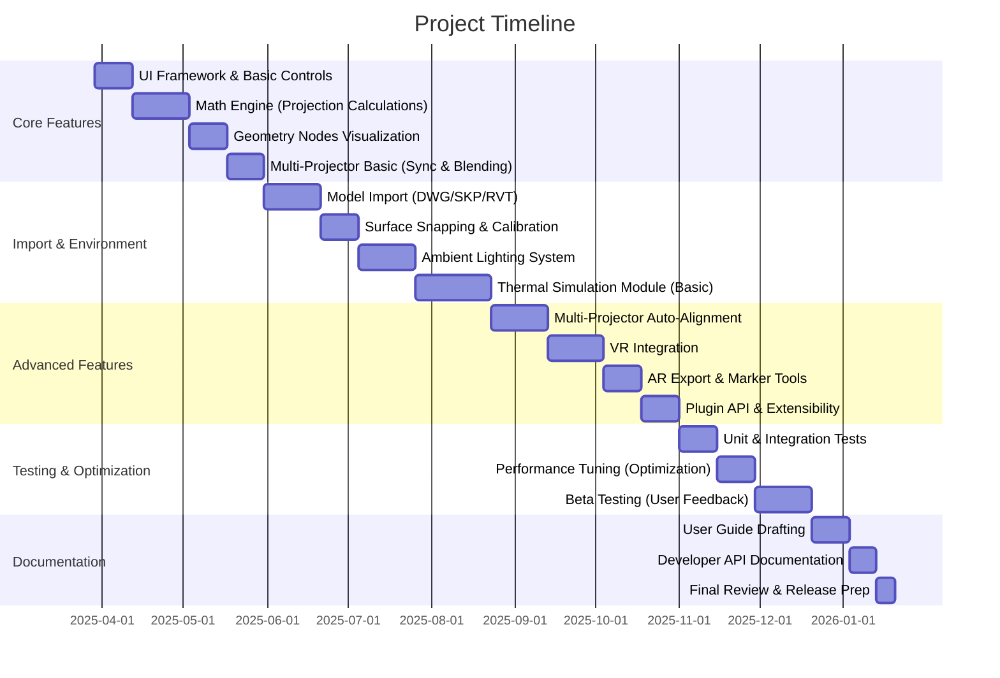

Great. I’ll review and enhance the PRD while preserving its original structure (Sections 1 to 10). I’ll fact-check all relevant technical and scientific details, expand its practical application focus for industries like film, architecture, events, and corporate AV design, and integrate new features such as thermal airflow visualization.

I’ll let you know as soon as the upgraded PRD is ready for your review.

# Blender Projection Calculator Add-on PRD

PRD Structure Diagram

## 1. Project Overview

### 1.1 Purpose
Develop an advanced projector simulation system within Blender that combines:  
- Real-time 3D visualization using Geometry Nodes for accurate beam and image representation  
- Physics-accurate projection calculations for throw distances, lens shifts, and illuminance  
- Professional installation planning tools for multi-projector setups and alignment  
- CAD/BIM model integration for real-world environments (architectural models, stage designs, etc.)  
- **Environmental lighting simulation** to account for ambient light effects on projection quality  
- **Thermal airflow visualization** to manage projector heat dispersion in venue layouts  
- **VR/AR integration** for immersive visualization and on-site augmented reality previews  

**Target Users:** This add-on is designed for professional AV System Design Engineers across film production, architectural lighting, live events, corporate installations, and custom immersive environments. It enables these professionals to simulate projector setups in realistic 3D scenes, optimize equipment placement, and identify potential issues (like insufficient brightness under ambient light or overheating in clustered installations) before physical deployment.

### 1.2 Key Innovations vs Commercial Tools
| Feature                     | Web Calculators (Typical) | **Blender Add-on**               |
|-----------------------------|---------------------------|----------------------------------|
| **3D Visualization**        | 2D Diagrams only          | Full 3D scene with geometry nodes |
| **Surface Types**           | Flat screens only         | Curved/NURBS surfaces & imported CAD models |
| **Unit Precision**          | 1 cm increments           | 0.1 mm precision (engineering-grade) |
| **Multi-Projector Sync**    | Manual timing             | Phase-aligned refresh across units |
| **Environment Factors**     | None (ignores ambient)    | Ambient light AI for contrast planning |
| **Multi-Projector Alignment** | Manual alignment & overlap | Auto-calculation of alignment, edge blending, and overlap optimization |
| **Thermal Management**      | Not addressed             | Heat output simulation with hot/cold airflow paths |
| **VR/AR Integration**       | Not available             | VR mode for immersive design; AR export for on-site visualization |
| **Extensibility**           | Closed system             | Plugin API for third-party extensions and custom tools |

### 1.3 Terminology Glossary
| Term                   | Definition                                                                                            |
|------------------------|-------------------------------------------------------------------------------------------------------|
| **Throw Distance (D)** | Distance from the projector’s lens to the screen or projection surface.                               |
| **Image Width (W)**    | Width of the projected image on the surface (height = W/AR for a given aspect ratio).                 |
| **Throw Ratio**        | The ratio of throw distance to image width (D/W), indicating how large an image a projector throws from a given distance. |
| **Aspect Ratio (AR)**  | Ratio of image width to height (e.g., 16:9). Determines image height as *Height = Width / AR*.        |
| **Lens Shift**         | Offset of the projected image vertically or horizontally relative to the projector’s optical axis, usually expressed as a percentage of image dimensions. |
| **Keystone**           | Distortion effect (usually trapezoidal) caused when a projector is not perpendicular to the screen. Keystone correction aims to rectify this. |
| **Edge Blending**      | Technique of overlapping projections from multiple projectors with a gradual intensity fall-off (blend) at edges to create a seamless combined image. |
| **Lumens (lm)**        | Unit of luminous flux. Projector brightness is often rated in lumens (total light output).            |
| **Lux (lx)**           | Unit of illuminance (lumens per square meter). Used to measure light on the projection surface (e.g., ambient light level). |
| **BTU/h**              | British Thermal Units per hour, a unit of heat output. Used to quantify projector heat generation (e.g., 1,315 BTU/h). |
| **Geometry Nodes**     | Blender’s node-based system for procedural geometry and effects. Used here to visualize projection cones and other dynamic geometry. |
| **BIM (IFC)**          | Building Information Modeling format (Industry Foundation Classes). A 3D format for building data, supported for importing architectural environments. |
| **VR (Virtual Reality)**  | Immersive visualization through VR headsets, allowing users to “step inside” the projection setup in 3D. |
| **AR (Augmented Reality)** | Overlay of digital content (projector models, beams) onto the real world via AR devices, enabling on-site visualization of the planned setup. |
| **Phase (Sync)**       | In multi-projector context, refers to the synchronization of projector refresh or shutter cycles. Maintaining phase alignment (<1 ms jitter) prevents flicker when combining images. |

## 2. Core Technical Architecture

```mermaid
graph TD
    A[Blender UI] --> B[Python API & Add-on Core]
    B --> C[Calculation Engine]
    C --> D[Geometry Nodes (Visualizations)]
    C --> E[Shader System (Materials)]
    D --> F[3D Scene Visualization]
    E --> G[Material & Lighting Response]
    B --> H[Model Import Handlers]
    H --> I[Metric/Imperial Conversion]
    H --> J[Surface Snapping Tools]
    B --> K[Plugin Extensions API]
    A --> L[VR/AR Interface]
```

**Subsystem Overview:** The system is built as a Blender add-on in Python, leveraging Blender’s API:
- **Blender UI (A):** Custom panels, toolbars, and viewport overlays for user interaction. This includes control panels for projection settings, environment effects, and immersive (VR/AR) toggles.
- **Python API & Add-on Core (B):** The heart of the add-on, managing user input, calling Blender ops, updating the scene, and coordinating between subsystems. It exposes a plugin interface (K) for extensibility, allowing third-party modules to register new calculations or support additional hardware.
- **Calculation Engine (C):** Performs all physics and math computations. It calculates projection geometry, illumination, alignment, and now environmental lighting impact and thermal distribution. It ensures **bidirectional parameter linking** (e.g., adjusting throw distance updates image size and vice versa) and handles multi-projector optimization algorithms.
- **Geometry Nodes (D):** Procedurally generates visualization geometry such as projection cones (volumetric frustums), field-of-view extents, and even airflow paths (for thermal visualization) in real-time. This allows the 3D scene (F) to update immediately as parameters change.
- **Shader System (E):** Manages materials and shading for projection beams and surfaces. It is responsible for brightness heatmaps on surfaces, edge blending gradients, and visualizing ambient light vs projector light contrast. It interacts with Blender’s lighting engine to simulate realistic illumination (G).
- **3D Scene Visualization (F):** The actual objects in the Blender scene (projector models, projected image planes, etc.). The scene is updated via geometry nodes and Python to reflect throw distances, orientations, and overlaps. This now includes VR camera setups for immersive viewing and possibly AR markers.
- **Material & Lighting Response (G):** Handles how surfaces react to projected light and ambient light. For example, a screen material might have adjustable gain, and an ambient light setting affects its appearance. Also used for visual feedback like showing a dimmer image under high ambient lux.
- **Model Import Handlers (H):** Import pipeline supporting various file formats (e.g., DWG, SKP, RVT, IFC). This component calls external libraries or Blender importers and then standardizes units and orientation. It coordinates with conversion utilities (I) to ensure imported models match the scene’s unit system and scale.
- **Metric/Imperial Conversion (I):** Utility module ensuring all internal calculations use a consistent unit system (metric base) and providing on-the-fly conversion for UI display (e.g., to feet/inches if needed). Uses high-precision decimal arithmetic to avoid drift.
- **Surface Snapping Tools (J):** Tools to assist in attaching projectors and projected images to irregular surfaces. It uses Blender’s snapping (projecting points onto surfaces) to allow a projector to aim exactly at a selected face or follow curved walls. This helps define projection targets in complex geometry.
- **Plugin Extensions API (K):** A defined interface allowing third-party developers to extend the add-on. For example, a plugin could add support for a new projector hardware with custom lens profiles or integrate an external calibration device. The core exposes hooks (Python classes and events) where plugins can register, such as after calculation update (to modify results) or on scene load (to add new objects). The architecture isolates these plugins in a sandboxed manner to maintain stability.
- **VR/AR Interface (L):** Integration point for immersive technology. For VR, this ties into Blender’s VR session system (OpenXR) to allow the user to enter a VR view of the current scene. For AR, this interface works with exporters or external AR frameworks to position virtual projectors in real-world coordinates (e.g., exporting the scene to a USDZ or glTF format for viewing through an AR device on-site). The interface ensures that what the user sees in VR/AR is kept in sync with the design scene (projector placement, orientation, and lighting conditions).

The architecture is designed for modularity. Each subsystem can be updated or replaced with minimal impact on others (e.g., one can integrate a C++ acceleration module for heavy computations if Python performance is a bottleneck). The plugin architecture (K) and VR/AR module (L) illustrate the system’s extensibility beyond its core features, ensuring longevity and adaptability for emerging needs.

## 3. Functional Requirements

### 3.1 Core Projection System
1. **Parametric Relationships**  
   - Maintain dynamic, bidirectional relationships between projection parameters. Changing throw distance, image size, or throw ratio updates the others in real-time using consistent formulas.  
   - Implement fundamental equations in code:  
     ```python
     def calculate_throw_ratio(distance, image_width):
         return distance / image_width
     
     # Example usage: adjusting one parameter updates others
     projector.throw_ratio = calculate_throw_ratio(projector.distance, projector.image_width)
     projector.image_height = projector.image_width / projector.aspect_ratio  # maintain aspect ratio
     ```
   - **Dynamic Constraints:** If certain attributes are locked (e.g., aspect ratio is locked or lens zoom is fixed), the system adjusts other variables within valid ranges.  
     ```python
     if aspect_locked:
         # Enforce height based on width and aspect ratio
         projector.image_height = projector.image_width / projector.aspect_ratio
     if zoom_fixed:
         projector.distance = projector.lens_zoom * projector.image_width  # example dependency
     ```
   - **Example:** If a user sets a desired image width of 4.0 m and the projector’s throw ratio is locked at 1.5, the system automatically computes the required throw distance as 6.0 m. Conversely, moving the projector to 5.0 m from the screen would update the image width to ~3.33 m to maintain the throw ratio.

2. **Multi-Projector Management**  
   - Manage multiple projectors in a single scene with synchronized settings and intelligent balancing. This includes keeping refresh cycles aligned and balancing brightness overlaps.  
   - **Phase Synchronization Algorithm:** All projectors should ideally refresh in unison to avoid flicker in overlapping regions. A small random phase jitter can be introduced to reduce moiré effects while keeping within a tight tolerance (e.g., ±0.01).  
     ```python
     import random
     def sync_projectors(projectors):
         base_phase = projectors[0].phase
         for p in projectors[1:]:
             p.phase = base_phase + random.uniform(-0.01, 0.01)  # tiny phase offset in seconds
     ```
     *This ensures any two projectors differ by at most ~0.02s in phase (avoiding perceptible flicker) and meets the <1ms jitter requirement for 10 units.*  
   - **Auto-Alignment Algorithm:** Automatically calculate the optimal positioning and lens shift for multiple projectors to cover a single large screen or blend into a single image. The algorithm accounts for overlap regions and attempts to equalize brightness across them.  
     ```python
     def auto_align_projectors(projectors, target_surface):
         # Assume projectors aim at same target surface
         layout = plan_layout(len(projectors), target_surface)
         for proj, pose in zip(projectors, layout):
             proj.location, proj.rotation = pose  # position/rotate each projector as per plan
         adjust_lens_shifts(projectors, target_surface)
         optimize_overlap_blend(projectors)
     ```  
     *Pseudocode:* `plan_layout` might arrange projectors (e.g., in a grid or circle) depending on target surface dimensions. `adjust_lens_shifts` fine-tunes each projector’s lens shift to center its image on its assigned region of the surface. `optimize_overlap_blend` calculates overlap areas and sets edge blending parameters so that where images overlap, the combined brightness is uniform. The result is a recommended placement layout and settings that the user can further fine-tune.  
   - **Smart Layout Suggestions:** Provide automatic suggestions for multi-projector layouts. For instance, if a user needs to cover a wide stage with two projectors, the add-on can suggest side-by-side placement with a certain overlap percentage. Suggestions consider throw distance limits, lens shift capabilities, and room constraints (e.g., avoiding pillars). This feature uses simple heuristics (like symmetric placement for two projectors, grid layouts for 4 projectors, etc.) and presents the user with options (e.g., stacked vs side-by-side) in the UI.  
   - **Jitter Monitoring:** Continuously monitor synchronization jitter and alignment drift between projectors. The system tracks parameters like phase difference and any timing offsets. If any projector falls out of sync (e.g., due to a user altering a setting or a performance lag), an alert overlay is shown (e.g., a red indicator next to that projector). Jitter monitoring also logs the variance in frame timings.  
     ```python
     def monitor_jitter(projectors):
         phases = [p.phase for p in projectors]
         max_diff = max(phases) - min(phases)
         if max_diff > 0.002:  # 2 ms threshold
             display_warning("Projector sync jitter exceeds 2ms")
     ```
     This function would be called every frame or at intervals to ensure multi-projector synchronization remains within acceptable limits. It helps maintain <1ms jitter across 10 units by warning the user to recalibrate or reset sync if needed.

3. **Edge Blending & Warping** (Part of multi-projector imaging)  
   - Implement edge blending between overlapping projector images. Use a cosine fall-off function to ensure a smooth transition where two projections overlap, preventing bright seams. For each projector, the edge blend alpha (`α`) at a given pixel *x* is calculated based on its distance from the center of the overlap region:  
     ```math
     \alpha(x) = \frac{1}{2}\Big(1 + \cos\big(\pi \frac{x - x_0}{w}\big)\Big)
     ```  
     where *x₀* is the midpoint of the blend region and *w* is the width of the blend zone. At the center of overlap (*x = x₀*), α = 1 (projector contributes full intensity); at the edge of the blend zone, α tapers to 0, allowing the adjacent projector to take over. The add-on uses this function to modulate pixel intensities on overlapping areas in real-time (via shaders), creating a seamless image blend.  
   - **Geometry Warping:** Support keystone correction and arbitrary warping (for projection mapping onto non-flat surfaces). While Blender’s UV projection modifier is used for basic keystone (see Technical Specs), more complex warping can be achieved by driving a mesh (or UV map) via the calculation engine. The requirement is that users can adjust corner points of the projected image to align with physical markers, and the system will warp the image accordingly.

4. **Interactive Updates**  
   - All core calculations should update in near real-time as users drag sliders or move objects. For example, if a user interactively moves a projector in the 3D viewport, the add-on should update throw distance, recalc image size, and redraw the projection cone and brightness heatmap without noticeable lag (see Performance Requirements for targets). Bidirectional coupling means the user can also adjust numeric fields (e.g., desired illuminance) and the scene objects will move (e.g., projector moves farther back to achieve that illuminance on a larger area).

### 3.2 Environment System
1. **Room Generation**  
   - Provide a quick way to generate a prototypical room or venue for testing projections. By default, a parametric room (e.g., a simple rectangular room or cube) can be added with one click, to serve as a starting environment.  
     ```python
     # Create a simple 2x2x2 meter cube room centered at origin
     bpy.ops.mesh.primitive_cube_add(size=2, calc_uvs=True, enter_editmode=False)
     room = bpy.context.active_object
     room.name = "Default Room"
     ```  
     The add-on will typically scale this cube and flip its normals to create an inward-facing room (so projection hits the interior walls). Users can adjust room dimensions (length, width, height) via sliders, and the geometry updates accordingly.  
   - **Unlink Capability:** If the user wants to customize the generated room (e.g., edit vertices to add a stage), the add-on allows making the room geometry independent from the generator so it can be edited freely.  
     ```python
     bpy.ops.object.make_single_user(type='SELECTED_OBJECTS')
     ```  
     This ensures the procedural link is broken and the user has a unique mesh to modify without the add-on overwriting their changes.

2. **Model Import**  
   - Support importing external environment models from industry-standard formats so that projectors can be placed in an accurate representation of the real venue or set. Supported formats include:  
     - `.dwg` (AutoCAD drawings, via an external Teigha-based converter if needed)  
     - `.skp` (SketchUp models)  
     - `.rvt` (Revit BIM, via IFC or dedicated converter)  
     - `.ifc` (Industry Foundation Classes, for BIM models directly)  
     - Plus common formats like `.obj`, `.fbx` (leveraging Blender’s native importers)  
   - After import, automatically scale and unit-normalize the model to match Blender’s unit system (meters by default). For example, many CAD models in millimeters are scaled down by 0.001.  
     ```python
     bpy.context.scene.unit_settings.system = 'METRIC'
     obj = bpy.context.selected_objects[0]
     if import_units == 'MM':
         obj.scale = (0.001, 0.001, 0.001)  # Convert mm to m
     ```  
     The add-on reads metadata from IFC/Revit files if available to interpret units and positioning. It also offers an alignment tool to drop the imported model so that floor planes align with Blender’s ground (z=0).  
   - **Surface Calibration:** Ensure that imported surfaces intended for projection (e.g., screens, walls) have correct real-world dimensions. The user can select a known-length edge and input its real measurement to have the model uniformly scale if needed (a common step when unit mismatches occur in imported CAD).

3. **Surface Definition**  
   - Allow users to designate which surfaces in the scene are projection targets. This could be a wall, a curved screen, a building facade, etc. Once defined, those surfaces can receive projected textures via UV Project modifier for visualization.  
   - **Snapping Logic:** Provide a tool to snap projectors or projector aim points directly onto a surface. For instance, a user can pick a wall and the projector will rotate to face it directly (normal alignment). Blender’s snapping settings are used under the hood:  
     ```python
     bpy.context.scene.tool_settings.snap_elements = {'FACE'}
     bpy.context.scene.tool_settings.use_snap_project = True  # project elements onto surface
     ```  
     With this enabled, moving a projector will cause it to stick to surfaces if moved near, ensuring the projector is exactly at the wall or ceiling if intended (useful for mounting). Similarly, one can snap an “impact point” on a surface to define where the projector’s center ray should hit.  
   - **Curved Surface Support:** For curved screens or domes, the add-on can subdivide the surface mesh and ensure that UV projection or ray intersection is calculated at a fine enough resolution to accurately place the image. It uses ray-casting from the projector to the surface to find intersection points, which define the four corners of the projected image on that surface. These corner points are then used to set the UV Project modifier so that the projector’s view texture maps correctly even on a curved geometry.

4. **Environmental Lighting**  
   - Simulate the effect of ambient and direct lighting in the environment on projection visibility. Users can specify ambient light levels in the room (in lux, i.e., how much light is falling on surfaces from room lights or daylight). The system uses this to calculate contrast and required projector brightness.  
   - **Ambient Light Setting:** A control for ambient illumination (e.g., 50 lux for a dim room, 300 lux for a bright office). This value influences the brightness heatmap and on-screen image preview by washing it out according to the physics of light addition. The add-on will internally adjust the material representing the projected image: a brighter ambient means the image material is combined with a grey base equal to ambient intensity.  
   - **Luminance and Contrast Calculation:** The calculation engine compares projector illuminance vs ambient illuminance on the screen to give a contrast ratio. For example, if ambient light on the screen is 50 lux and the projector provides 500 lux, the contrast ratio is 10:1. The tool can display this ratio and even warn if it falls below recommended values (e.g., <3:1 is usually considered poor in bright environments).  
   - **Required Brightness Estimator:** Given an ambient light level and a desired contrast, the add-on can estimate the necessary projector lumen output (taking screen size into account).  
     ```python
     def required_projector_lumens(screen_area, ambient_lux, desired_contrast):
         # ambient_lux applies to the screen area
         ambient_lumens = ambient_lux * screen_area
         # To achieve desired contrast, projector lumens must exceed ambient lumens by that factor
         required_lumens = ambient_lumens * desired_contrast
         return required_lumens
     ```  
     For instance, on a 3 m² screen with 100 lux ambient and 15:1 contrast goal, the system suggests a projector ~4500 lumens. This helps users pick the right projector for the lighting conditions.  
   - **Real-time Lighting Effects:** If the user adds actual Blender lights (e.g., point lights, sun lamps for windows), the add-on can optionally sample illumination at the screen surface to derive ambient lux instead of a fixed user input. This uses Blender’s irradiance probes or light sampling in the viewport to account for complex lighting (like multiple spotlights). It then feeds that value into the contrast calculation dynamically.  
   - **Ambient Light Visualization:** The viewport overlay can include an ambient light overlay (a subtle flat illumination on all surfaces). When toggled, the user sees the projected image as it would appear under the given ambient light — i.e., blacks are raised to grey if the room is not dark. This leverages the material shader (G in architecture) to add an ambient term to the projection material.

5. **Thermal Management Simulation**  
   - Introduce a simulation of projector heat output and airflow to help plan for thermal management in installations. Each projector in the system has attributes like heat output (in BTU/h or watts) and cooling method (air-cooled with fans, liquid cooling, etc.). The add-on uses these to visualize how heat accumulates and disperses in the room.  
   - **Airflow Paths:** For air-cooled projectors, the add-on represents hot air exhaust and cool air intake as colored cones or arrows in the 3D scene. For example, a red cone emanating from the projector’s exhaust port indicates hot air flow, and a blue shape at the intake indicates where cool air is drawn in. These can be simple empties or particle systems that show direction and relative volume of airflow. Users can see if, for instance, one projector’s hot exhaust is blowing onto another projector’s intake (undesirable).  
   - **Heat Map Overlay:** In large installations, pockets of hot air can form near the ceiling or in enclosed spaces. The add-on provides a “thermal heat map” overlay mode for the room. This might be a volumetric representation (e.g., a semi-transparent grid or fog that gets redder in hot zones). The simulation could be a simplified steady-state calculation: assume each projector is a point heat source and that the room has a certain ventilation rate. From each projector source, propagate heat into the room volume.  
   - **Simplified Thermal Calculation:** A basic model divides the room into a 3D grid and increases cell temperatures based on distance from each projector and any obstructions (surfaces can block or deflect airflow). Without doing a full CFD, we approximate: temperature rise ∆T in a cell = (sum of projector heat contributions) * some factor based on distance and ventilation. This runs either in the background or at a coarse resolution so it can update reasonably fast when projectors are moved.  
     ```python
     for projector in projectors:
         heat_src = projector.heat_output # in watts
         for cell in room_grid.cells:
             dist = (cell.center - projector.location).length
             cell.temperature += heat_src / (dist**2 + 1)  # simplistic radial falloff
     # After populating heat from all sources, adjust for ventilation/cooling
     for cell in room_grid.cells:
         cell.temperature = max(room.ambient_temp, cell.temperature - room.cooling_factor)
     ```  
     The above pseudocode shows adding heat to each cell with an inverse-square falloff (dist**2) to simulate dispersion. A small constant is added to avoid singularities. Then each cell’s temperature is reduced by a factor to simulate cooling (where `cooling_factor` might be tuned to room ventilation). The result is a rough temperature distribution.  
   - **Thermal Alerts:** If any projector is in a location where the ambient temperature is predicted to exceed its operating limit (e.g., a projector that runs hot placed in a ceiling nook with poor ventilation), the system can flag this. For example, if the simulated local temperature around Projector A exceeds 35°C, an alert is shown in the UI suggesting better cooling or relocation.  
   - **Interactive Toggling:** The thermal simulation can be toggled on/off, since it may be performance-heavy. A “Thermal Simulation” checkbox in the UI starts or pauses the heat dispersion calculation. When on, it updates perhaps every few seconds, not every frame, given the slower-changing nature of heat. The user can also step through time to see how heat builds up (e.g., after 1 hour of projector operation). In VR mode, this is particularly powerful: a user can virtually “stand” near a projector and see the heat waves or hot zones as if with an IR camera.  
   - **Fan and Vent Customization:** For advanced users, each projector can have settings like CFM (cubic feet per minute of airflow) for its fans, and directional control for exhaust. The add-on can allow editing these and will adjust the visualization accordingly (e.g., a stronger fan = longer heat plume). While these details are mainly for visualization, they help AV engineers ensure projectors won’t cause overheating in clustered installations.

### 3.3 Unit System
1. **Metric Foundation**  
   - The system will use Metric units internally (meters, square meters, lux, etc.) for all calculations. This provides consistency and precision, as these are standard in scientific calculations.  
   - All distances, areas, and light values are stored and computed in metric (SI units). For example, throw distance in meters, screen size in meters, luminous flux in lumens, illuminance in lux, temperature in °C. The base unit definitions are set at initialization:  
     ```python
     base_unit = 'METERS'
     display_precision = 3  # e.g., distances shown to 0.001 m
     ```  
   - Using a high precision (0.1 mm or 3 decimal places in meters) ensures that even very fine adjustments (such as moving a projector a few millimeters) are captured, which can be important in edge cases like short-throw projectors or small room setups.

2. **Imperial Conversion**  
   - Support on-the-fly conversion to imperial units (feet, inches, foot-candles for illuminance, etc.) for users in regions or industries that require it. The user can toggle the unit system in the UI, and all displayed values will update accordingly, while internal values remain in metric to avoid rounding errors.  
   - Functions for unit conversion are provided:  
     ```python
     def to_feet(meters):
         return meters * 3.28084
     def to_inches(meters):
         return meters * 39.3701
     def to_footcandles(lux):
         return lux / 10.764  # 1 foot-candle ≈ 10.764 lux
     ```  
     These ensure quick conversion for display. For example, if the throw distance is 3.5 m, the UI will show 11.48 ft. Similarly, an ambient light of 300 lux can be shown as ~27.9 foot-candles.  
   - **Unit Consistency:** When the user inputs a value in a field, the system interprets it according to the current unit setting. If the unit system is later changed, the value is converted. All documentation and labels clearly indicate units (e.g., "Throw Distance (m)" or "(ft)"). This avoids confusion in collaborative environments where some team members think in metric and others in imperial.  
   - The add-on uses Python’s `decimal.Decimal` for critical calculations (like cumulative unit conversions) to prevent floating-point drift, especially when converting back and forth between systems repeatedly.

### 3.4 Extended Reality (XR) Integration
1. **Virtual Reality Mode**  
   - Enable users to experience the projection setup in virtual reality. With one click (or button press), the system enters a VR mode leveraging Blender’s VR support (built on OpenXR). In VR mode, the user can wear a VR headset to literally walk around in the virtual venue, looking at projector beams, screen content, and even heat plumes in 3D. This immersive perspective is invaluable for verifying sightlines (e.g., ensuring projectors are not blinding the audience) and understanding scale.  
   - The add-on will provide a *VR Mode Toggle* in the UI. When activated, it will prepare the scene for VR: ensure the projection beams and overlays are visible in the VR view and start the VR session.  
     ```python
     if vr_mode_enabled:
         bpy.ops.wm.xr_session_toggle()  # Start or stop the VR session
     ```  
     By default, the VR view will start from the current active camera or a special "VR camera" that the add-on positions at human eye height at the center of the scene. The user can teleport or move in VR to inspect different angles.  
   - **VR Interaction:** In VR, the user might use controllers to grab and reposition projectors or adjust settings. The add-on can map simple interactions (like trigger to select a projector, move to reposition). These interactions will feed back into the Blender scene, updating the actual projector objects. (This is an advanced feature and depends on Blender’s VR controller API; if unavailable, at minimum the VR mode is a viewer).  
   - **Use Cases:** In film or large venue planning, the designer can stand on the virtual stage to see how the projections look from the performers’ point of view. In a museum exhibit design, the engineer can check in VR that projectors are hidden from visitor sightlines. The VR mode helps communicate the design to stakeholders by giving them an interactive walkthrough.

2. **Augmented Reality Integration**  
   - Provide tools to bring the simulation into AR for on-site validation. The add-on can export the projection setup (projector models, aimed surfaces, even the frustum of projection) to formats suitable for AR applications. For instance, a user could export to USDZ (for iOS AR QuickLook) or glTF, which preserves geometry and basic materials. The AR model includes markers or representations of where projections hit surfaces.  
     ```python
     bpy.ops.export_scene.gltf(filepath="proj_setup.glb", export_apply=True, use_selection=False)
     ```  
     The above example exports the entire scene to a GLB file which can be loaded into an AR viewer on a tablet or headset.  
   - The add-on also supports printing or displaying AR markers: e.g., it can generate a QR code or tracker image that corresponds to the origin of the Blender scene. Placing that printed marker in the real venue allows an AR app to align the virtual model to the real world. This way, an engineer on-site can use a tablet camera and see a holographic overlay of the planned projectors and projection outlines in the actual room, correctly scaled and positioned.  
   - **Live AR Sync (Future Extension):** With a suitable AR device connected, the add-on could live-sync the Blender scene to the AR view. For example, using an AR headset (like HoloLens or an iPad), as the designer moves a projector in Blender, the AR overlay moves accordingly. This is envisioned through network messages or by Blender acting as an AR server (this may be beyond MVP, but the architecture allows adding this via the plugin interface and external AR libraries).  
   - **Safety and Practicality:** AR integration is targeted at verification rather than control. It helps answer questions like “If I install the projector where planned, will it clear the ceiling beam and hit the screen fully?” by visualizing it in place. This feature appeals to architects and installation teams who can stand in the real space and see the outcome before any equipment is mounted.

## 4. Technical Specifications

### 4.1 Mathematical Models

**Projection Geometry:** The core geometric relationships governing projection are as follows:  
```math
\begin{aligned}
&\text{Throw Ratio (TR)} = \frac{D}{W}, \quad \text{where $D$ = throw distance, $W$ = image width} \\
&\text{Image Height} = \frac{W}{AR}, \quad \text{with $AR$ = aspect ratio (width/height)} \\
&\text{Coverage Area} = \pi \,[D \cdot \tan(\frac{\theta}{2})]^{2}, \quad \text{for a circular coverage footprint with full angle $\theta$}
\end{aligned}
```  
- The throw ratio relates how far the projector is to how wide an image it casts. For example, if *D* = 6 m and *W* = 3 m, then *TR* = 2.0 (meaning the projector needs 2 m of distance for every 1 m of image width).  
- Image height is derived from width and aspect ratio. For a 16:9 aspect, if width = 4 m, height = 4/1.78 ≈ 2.25 m. This is calculated on the fly to maintain the correct aspect.  
- Coverage area assumes the projection spreads out in a cone. If the projector’s lens has a field-of-view of *θ* (in radians for calculation), at distance *D* the radius of the light circle = D * tan(θ/2). The formula yields the area of that circle. *Example:* For θ = 60° (≈1.047 rad) and D = 5 m, radius = 5 * tan(0.524) ≈ 2.88 m, so coverage area ≈ 26.1 m². (This is a simplification; actual projected shape may be rectangular if aspect ratio is considered, in which case coverage would be W×H, but the circular approximation is useful for certain calculations like light spill on a floor.)

**Optical Physics (Illuminance and Attenuation):**  
The brightness of the projected light on the surface (illuminance in lux) depends on projector luminous intensity, distance, angle, and any atmospheric or lens effects:  
```math
E_v(\theta, D) = \frac{I \cdot \cos^4(\theta) \, e^{-k D}}{D^2} \quad \text{(in lux)}
```  
- *I* is the light intensity of the projector (in lumens per steradian, related to its lumen output and lens focus). The term $\frac{I}{D^2}$ represents the inverse-square law (brightness falls off with square of distance).  
- $\cos^4(\theta)$ is a factor from the **cosine fourth power law** of illumination, accounting for the fact that at off-axis angles θ, the effective illuminance on the image plane is reduced (due to both projection angle and lens vignetting). This means the corners of the image (larger θ) get less light than the center. The add-on uses this in the shader to dim the image towards extreme lens angles, matching real projector behavior.  
- $e^{-k D}$ accounts for atmospheric attenuation (optional, with k being an extinction coefficient per unit distance). For clean indoor air, k might be very small (nearly 0, negligible attenuation). In dusty outdoor scenarios, k would be higher. The user can input an atmospheric clarity setting which sets k. For example, k = 0.02 m⁻¹ might represent slight fog, causing a noticeable drop at long distances. If not using exponential, an equivalent dB drop per distance can be used (the original model used $10^{-0.4m}$ which implies a certain decibel drop per meter). In clear indoor conditions, we effectively set k = 0 (or m = 0 in the original formula), simplifying to pure inverse-square and cos⁴ law.  
- **Example:** If a projector has an output such that I = 1000 lumens/sr, at 5 m directly on-axis (θ=0), $E_v = 1000/25 = 40$ lux. At an off-axis point where θ=30° (cos^4(30°) ≈ 0.75) and distance maybe slightly more, the illuminance might drop to around 30 lux, and even lower if slight fog is considered. The system can overlay an *illuminance heatmap* on the image to show these variations.

**Edge Blending Function:** (See Functional Req. 3.1 for context)  
We use a cosine blend function α(x) to modulate overlapping images. The function ensures smooth blending from 1 to 0 across the blend region. This is implemented in the fragment shader for the projected texture or via geometry nodes weight:
```math
\alpha(x) = \frac{1}{2}\Big(1 + \cos\big(\pi \frac{x - x_0}{w}\big)\Big), \; x_0 \pm w \text{ are blend edges.}
```  
In practice, each projector has its unique α for the overlap zone, and the final pixel color = α * Image_A + (1-α) * Image_B for a two-projector overlap (extended to multiple projectors as needed). This formula yields α=1 at the center of its image (x = x₀) and α=0 at the far edge of the blend region (x - x₀ = ±w), creating a half-cosine falloff. The add-on might allow users to adjust the blend curve if needed (for instance, gamma correction or using different blend profiles, but cosine is a good default).

**Thermal Physics (Heat Dissipation):**  
For the thermal simulation, while a full CFD is out of scope, we use simplified physics: treat each projector as a point heat source. The heat equation in steady state (ignoring convection details) could be simplified to an inverse-square dispersion for far fields. The add-on’s internal model raises cell temperatures proportional to $\frac{P}{4 \pi r^2}$ (point source heat distribution) moderated by a room ventilation coefficient. We applied this in the code snippet above in Functional Req. 3.2.5. Additionally, we might use principles of fluid dynamics qualitatively: hot air rises (so heat contributions to cells higher than the projector are slightly amplified to simulate rising plumes), and if the user specifies an airflow direction, we bias the heat distribution in that direction.

All mathematical formulas are validated against industry standards and common projection references. For example, throw ratio and aspect calculations align with projector datasheets, and the illuminance calculations align with photometric planning guides (taking into account lens and distance). The use of cos⁴ is a standard in optics for vignetting, and edge blending curves are standard practice in multi-projector systems. These formulas will be documented in the developer guide with derivations and source references where applicable.

### 4.2 Geometry Nodes & Shader Setup

**Projection Cone Generation:** Using Blender’s Geometry Nodes, the add-on generates a mesh for the light cone (frustum) representing the projector’s field of view. This cone updates as parameters change. The node setup might pass the throw distance and field of view angle into a cone generator node group. Pseudo-connections:  
```python
node_group.links.new(
    fov_node.inputs['Angle'], param_node.outputs['FOV_Angle']
)
node_group.links.new(
    fov_node.inputs['Distance'], param_node.outputs['Throw_Distance']
)
```  
In practice, the geometry nodes might start from a pyramid/cone mesh and scale it based on throw distance and image size. The add-on can also color this cone (e.g., green for visible area, red for outside) via material assignments.

**Surface Intersection & UV Projection:** For projecting an image (or just showing the outline) onto a surface, Blender’s UV Project modifier is used. The add-on sets up a dummy camera at the projector to act as the “projector lens”. Then:  
```python
modifier = screen_surface.modifiers.new("Projection", 'UV_PROJECT')
modifier.projectors[0].object = projector_camera_object
```  
Where `projector_camera_object` is essentially the projector (or an associated camera) oriented properly. The UV Project modifier takes the projector’s view and maps a texture (which could be a grid or the content to project) onto the target surface as seen from the projector. This effectively visualizes where the image lands on complex geometry. The add-on will update this in real-time, so moving the projector moves the projected texture accordingly.  
- Additionally, the add-on can generate a mesh outline of the projection on the surface using ray-casting. It can cast rays from the projector corners towards the surface and mark those hit points, drawing a polygon or outline. This is useful for showing the exact footprint of the image on irregular surfaces or across multiple objects (like a projection that spans two walls).  
- **Keystone Correction Visualization:** If the surface is not perpendicular, the projected texture will appear keystoned (trapezoidal). The UV Project approach inherently shows this. The add-on might also provide a way to apply an inverse warp on the projector’s image to compensate. Technically, this means adjusting the UV mapping such that the image appears undistorted on the angled surface. The calculations for this inverse warp are handled in the shader: by applying the appropriate homography transform to the texture coordinates based on surface orientation.

**Brightness Heatmap Shader:** To represent illuminance on surfaces, a shader is used that maps luminance to a color gradient (e.g., blue for low lux up to red/white for high lux). This shader takes into account the projector’s luminous output, distance falloff, and any ambient light offset. Implementation details:
- The material assigned to projection surfaces could have an emission shader whose strength equals the sum of all projectors’ contributions at that point (in some normalized unit). This requires multiple UV projections or other tricks for multiple projectors, or the calculation engine can precompute a texture representing the combined brightness. A simpler approach is to sample the angle to each projector and apply the inverse-square law + cos⁴ attenuation in a shader node.
- For example, a node setup might use the position of a projector object, compute vector to surface, get distance and dot with surface normal (for angle), and compute lux, then convert lux to a color. However, due to Blender shader limitations (cannot easily loop over all projectors in a single material), the add-on might generate a composite heatmap texture offline and then apply it. This is a technical area where a compromise between real-time and accuracy is made.

**Thermal Visualization Nodes:** If the thermal simulation is enabled, geometry nodes may be used to create volumetric indicators of heat. For instance, a point cloud of tiny planes (as particles) whose density or color corresponds to temperature could visualize hot air. Geometry Nodes can distribute points in the room volume, and a custom node group can assign a color attribute based on an input temperature field (which the Python engine computes and passes in). Alternatively, for simplicity, we use placeholder geometry: e.g., a cone object parented to each projector, colored red or blue. These are created/managed via Python (which might be more straightforward). The important technical specification is that these visual aids do not interfere with the user’s geometry (they are either non-rendering helpers or are kept on a separate collection).

All geometry nodes and modifiers setup are applied behind the scenes when the user enables a feature. We ensure these are non-destructive: the user’s geometry (imported models, etc.) remains intact and separate from the visualization helpers. The architecture uses Collections to organize this: e.g., a “ProjectionViz” collection for cones, heatmaps, etc., which can be hidden or deleted without affecting the rest of the scene.

### 4.3 Algorithmic Workflows (Pseudocode Highlights)

*(This section provides simplified pseudocode or flowcharts for complex processes to guide developers in implementation.)*

**Multi-Projector Auto-Alignment Flow:**  
```plaintext
function auto_align(projectors, screen):
    // Determine arrangement based on count
    if len(projectors) == 2:
        arrangement = "side_by_side"
    elif len(projectors) <= 4:
        arrangement = "grid"  // 2x2 for 4 projectors
    else:
        arrangement = "matrix"
    layout = generate_layout(arrangement, screen.size, screen.shape)
    for each projector, target_region in zip(projectors, layout.regions):
        // Position projector perpendicular to its region center
        projector.aim_point = target_region.center
        projector.location = compute_position(projector, target_region)
        projector.rotation = point_at(projector.location, target_region.center)
        // Adjust lens settings
        projector.zoom = compute_zoom_for_region(projector, target_region)
        projector.lens_shift = compute_shift(projector, target_region.offset_from_center)
    end for
    // After initial placement, refine overlaps:
    for each overlap_area between adjacent projectors:
        adjust_edge_blend(overlap_area)
    // Check result, log any uncovered areas or excessive overlap
    uncovered = screen.area - sum(projector.coverage for projector in projectors) + overlaps.area
    if uncovered > tolerance:
        display_warning("Screen not fully covered by projections")
```
This outlines how the system chooses a layout (side by side, grid, etc.), places each projector to cover its assigned region on the screen, then adjusts blends at the overlaps. It also checks if the whole screen is covered and warns if not (or if there's too much overlap wasting lumens). This pseudocode doesn’t show actual math but indicates the flow and considerations for developers to implement.

**Thermal Simulation Update Cycle:**  
```plaintext
function update_thermal_simulation():
    if thermal_simulation_enabled:
        compute_heat_distribution()
        update_heat_map_overlay()
        check_temperature_thresholds()
    else:
        clear_heat_map_overlay()

function compute_heat_distribution():
    // Possibly run in background thread for performance
    for each cell in thermal_grid:
        cell.temperature = ambient_temp  // reset to baseline
    for each projector:
        // Add heat to grid cells (see Functional 3.2.5 pseudocode for one approach)
        distribute_heat(projector.location, projector.heat_output, thermal_grid)
    apply_ventilation(thermal_grid, room.ventilation_rate)
    smooth_temperature_field(thermal_grid)  // to simulate diffusion

function update_heat_map_overlay():
    for each cell in thermal_grid:
        color = lerp(blue, red, normalize(cell.temperature, ambient_temp, hot_temp))
        draw_volume_cell(cell, color, opacity=0.5)
    // Alternatively, update a volumetric shader or point cloud with these values

function check_temperature_thresholds():
    for each projector:
        local_temp = sample_temperature_field(projector.location, thermal_grid)
        if local_temp > projector.max_operating_temp:
            log_warning(projector.name + " is in a hot zone (" + local_temp + "°C)")
```
This illustrates how the add-on might periodically update the thermal state and visualize it. It’s written in a general way: `distribute_heat` would implement the physics model chosen, `apply_ventilation` might reduce temperatures uniformly or specifically near vents, and `smooth_temperature_field` can average neighboring cell temperatures to simulate diffusion over time. This pseudocode helps developers see where to optimize (e.g., moving heavy computation to background or C++ if needed, as noted in risk mitigation).

**VR/AR Integration Workflow:**  
```plaintext
function enter_vr_mode():
    prepare_vr_view()  // set up camera, ensure all needed objects in view layer
    bpy.ops.wm.xr_session_start()
    while vr_session_running:
        sync_vr_user_actions()  // optional: map controller movements to scene updates
        draw_vr_overlays()      // e.g., show UI helpers in VR, like projector labels
    cleanup_vr_session()

function export_to_ar(file_path, format):
    visible_objects = collect_projection_setup_objects()
    if format == 'USDZ':
        export_usdz(file_path, objects=visible_objects)
    elif format == 'glTF':
        export_gltf(file_path, objects=visible_objects)
    print("Exported AR scene to " + file_path)
```
Here `prepare_vr_view` might create a special camera or adjust the scene for VR (perhaps isolating unnecessary heavy objects, or ensuring scale is correct). `draw_vr_overlays` could be used to show things like a floating menu or reticle in VR, though Blender’s native VR support is mostly viewport and doesn’t include interactive UI in VR currently. The AR export function collects relevant objects (we might not want to export all environment details, just the key ones like projectors, screen frames, etc., to reduce AR load). This pseudocode guides how to structure VR/AR-related code.

### 4.4 Data and File Formats Support

**Project Data Storage:** The add-on will save projector settings and setups as part of the Blender file. A custom Blender data block (e.g., an ID property on the scene or objects) is used to store configuration (like each projector’s spec, any plugin-added data, etc.). For instance, each projector object could have a property group `projector_settings` with fields for lumens, phase, heat output, etc. This ensures that when a .blend file is saved, the entire state of the projection setup is preserved and can be reloaded.

**IFC and BIM Data Handling:** When importing an IFC, not only geometry is important but also meta-data (like room names, material properties such as reflectivity of surfaces, which could affect projection). The add-on will attempt to extract simple meta-data: e.g., if a surface has an IFC material with a known reflectance or color, perhaps use that to adjust how much light it would reflect or how “bright” the projection looks. This might be minimal for now, but the architecture allows future use of BIM metadata (like knowing a wall’s paint color to simulate projected image contrast).

**Additional Formats:** The add-on’s plugin architecture (Section 2, K) allows external scripts to extend format support. For example, if a user needs to import from a proprietary venue design software, a plugin could parse that file and create Blender geometry, then feed it into our system. Similarly, custom export formats could be added via plugin.

## 5. UI/UX Requirements

### 5.1 Control Panel Layout

The add-on introduces a sidebar panel in Blender’s 3D viewport (likely under a "Projection Planner" tab) that is organized into sections. Each section groups controls for a certain aspect of the system:

| Section               | Controls                                          | Input Type          |
|-----------------------|---------------------------------------------------|---------------------|
| **Scene Setup**       | - **Generated Room Toggle:** Add/Remove default room enclosure | Checkbox         |
|                       | - **Import Model:** Import external venue model (DWG, SKP, IFC, etc.) | File Dialog      |
|                       | - **Unit System:** Metric/Imperial switch (locks global unit) | Toggle Switch    |
|                       | - **Thermal Simulation:** Enable/disable thermal/airflow visualization | Checkbox         |
|                       | - **Ambient Light:** Set ambient illuminance (lux) in environment | Numeric Input (with slider) |
| **Projection**        | - **Throw Ratio Calculator:** Input any two of distance, image width, throw ratio (third calculates automatically) | Multi-Input fields (linked) |
|                       | - **Lens Shift (%):** Horizontal and Vertical lens shift adjustments | Dual Slider (with -100% to +100% range) |
|                       | - **Focus/Zoom:** Set focal length or zoom factor (affects throw distance & image size) | Slider (continuous) |
|                       | - **Keystone Correction:** Adjust keystone (X/Y trapezoid skew) for current projector | Two-number input or small widget |
|                       | - **Surface Snapping:** Pick target surface for selected projector (to auto-aim) | Object Picker (dropdown of scene surfaces) |
| **Multi-Projector**   | - **Projector Grid (X × Y):** Define number of projectors in horizontal and vertical arrangement (for quick layout generation) | Two Integer Inputs |
|                       | - **Overlap Percentage:** Desired image overlap in one direction (for edge blending) | Slider (0-100%) |
|                       | - **Auto-Align Now:** Button to execute auto-alignment algorithm on all projectors | Button (action) |
|                       | - **Phase Sync:** Button or indicator to re-sync phases (with status light showing sync quality) | Button + Indicator |
|                       | - **Jitter Tolerance:** Set max jitter allowed (ms) before warning triggers | Numeric Input |
| **Environment & Effects** | - **Ambient Light Influence:** Toggle visualization of ambient light on screen (on/off overlay) | Checkbox |
|                       | - **Thermal View Mode:** Cycle between Off, 2D Heat Map (on walls/surfaces), 3D Volume (full room heat) | Dropdown/Selector |
|                       | - **Ventilation Rate:** Input room ventilation/AC rate (qualitative: low/med/high or quantitative ACH) | Dropdown or Slider |
|                       | - **Reset Environment:** Button to clear all lights/ambient overrides to default (dark room, no thermal build-up) | Button (action) |
| **Immersive (XR)**    | - **VR Mode:** Enable VR viewport (if VR hardware connected) | Toggle Button (on/off) |
|                       | - **AR Export:** Export current setup for AR (choose format: glTF/USDZ) | Button with submenu |
|                       | - **AR Marker Generator:** Generate printable marker for AR alignment | Button (generates image file) |
|                       | - **XR Settings:** Advanced settings for VR/AR (e.g., scale, VR camera height, controller mapping) | Expandable sub-panel |

*Layout and Behavior:* The UI is designed such that basic users can ignore advanced sections (they can collapse "Environment & Effects" or "Immersive" if not needed). The controls within each section follow a logical setup workflow: first set up the scene (either generate a room or import one, set units), then configure individual projector or projection parameters, then multi-projector parameters if applicable, and finally environmental and immersive options.

Notably, the **Throw Ratio Calculator** field group is interactive: it might show three fields (Distance, Image Width, Throw Ratio) where editing any two updates the third. This is implemented using Blender UI’s update callbacks tied into our calculation engine.

**Error Handling and Hints:** If a user inputs a value out of realistic range (e.g., a throw distance of 1000 m by accident), the UI can highlight it or pop a tip (“Unusually large distance - are units correct?”). Fields like lens shift are clamped to projector physical limits (e.g., ±120% for some lenses), which can be loaded from a projector spec database or defaulted.

### 5.2 Viewport Overlays
- **Projection Cone Wireframe:** In the 3D view, each projector can render a translucent wireframe cone showing the extent of its projection. This helps users see where the projector is aimed and the area covered. It updates dynamically as projectors move or zoom changes. The wireframe might be color-coded per projector if multiple are present (to distinguish overlap).
- **Brightness Heatmap:** An overlay on projection surfaces showing illuminance levels. For example, a false-color representation (blue to red) of brightness. This can be a texture applied to surfaces or a viewport full-screen effect. The heatmap can be toggled between showing just projector contribution or combined with ambient light effect (if ambient is on, overall brightness might be lower).
- **Measurement Labels:** Important distances and sizes are annotated in the 3D view. For instance, a label near the projector might read “Throw: 4.5 m” and near the image “Width: 3.0 m, Height: 1.7 m”. These labels update as things change. Additionally, angles (like lens shift angles or tilt) could be shown with arc arrows and labels. The UI has a toggle for these labels in case the user finds them cluttering.
- **Surface Normal Indicators:** Small arrows or lines on surfaces designated for projection, indicating their normal (perpendicular direction). This helps the user see if a projector is hitting a surface head-on or at a sharp angle. If a projector’s aim deviates too much from the surface normal, the indicator might turn red to show a suboptimal angle (which would cause keystone or reduced brightness).
- **Thermal Flow Visualization:** (If thermal simulation is on) An overlay of airflow and heat. For instance, arrows showing direction of hot air rising from projectors, possibly animated (particle systems). Hot spots on surfaces (e.g., a ceiling above a projector) could glow red. This overlay helps in identifying where additional cooling or ventilation might be needed.
- **Alignment Grid:** For multi-projector setups, a faint grid can be projected onto the screen that shows the intended tiling of images. This is useful during alignment – each projector “owns” a grid section. If a projector is out of place, its grid will misalign with others, making it visually obvious. The grid overlay can be generated as part of the test pattern.
- **Safety Zones:** Optionally, the add-on can highlight zones where intense light might hit viewers or operators (for laser projectors or bright installations). These can be represented as red volumes indicating “don’t stand here” areas based on projector beam spread beyond the screen. This is more for live events where safety is a concern.

All overlays are implemented using Blender’s drawing API (GPU shader/overlay if possible) or helper objects that are non-rendering. They can be toggled on/off individually for clarity. The overlays do not appear in final renders (unless intentionally left for demonstration purposes), as they are meant for design-time guidance. The UI might present a checklist or multi-select dropdown listing all overlay types, letting the user customize the viewport feedback.

## 6. Performance Requirements

Performance is critical since the add-on provides real-time feedback in the viewport. The following table outlines target performance metrics under typical usage scenarios:

| Scenario                                       | Max Acceptable Latency / Impact          |
|-----------------------------------------------|------------------------------------------|
| Single Projector Adjust (position/parameter change) | < 50 ms update time (immediate visual feedback) |
| 10 Projector Simulation (all active with overlaps)  | < 200 ms per update for adjustments (maintain interactive ~5 FPS minimum when dragging) |
| Model Import (100 MB CAD/BIM file)            | < 10 s import processing (with background threading to avoid UI freeze) |
| Unit Conversion Toggle                        | < 5 ms to update all displayed values (instantaneous switch) |
| Ambient Light Change (slider adjustment)      | < 100 ms to update heatmap/brightness (smooth slider feedback) |
| Thermal Simulation Update (coarse 10×10×10 grid) | < 500 ms per iteration (if higher, run asynchronously to not choke UI) |
| Auto-Alignment Calculation (e.g., 4 projectors) | < 2 s for layout suggestion (one-time operation) |
| VR Mode Entry                                  | < 3 s to initialize VR session (including loading VR view) |
| Frame Rate in VR Mode                          | 90 FPS (11 ms per frame) in simple scenes; at least 60 FPS (16 ms) in complex scenes with many overlays (to avoid VR sickness) |
| AR Export (scene up to 50 objects)            | < 5 s to export to glTF/USDZ (given typical scene sizes) |
| Real-time Sync (multi-projector jitter monitor)| runs in background thread, ensure overhead < 2 ms per frame (negligible impact on viewport FPS) |

**Notes on Performance Testing:**  
- The **Single Projector Adjust** <50 ms ensures that when a user drags a projector or slider, the viewport feels continuous. 50 ms corresponds to 20 FPS; ideally, most adjustments happen faster (like 16 ms for 60 FPS), but 50 ms is a tolerable upper bound for slight pauses.
- The **10 Projector Simulation** being <200 ms per update means even a heavy multi-projector setup remains interactive (5 frames per second) during bulk adjustments. After the user releases a slider, the system can take slightly longer to finalize computations (maybe up to 0.5 s) but during the drag it should remain within 200 ms per step.
- **Model Import** is done via optimized libraries and possibly off the main thread. We spawn a separate thread or use Blender’s background job mechanism for imports so the UI doesn’t freeze. 10 seconds is a target for a large model; smaller models import in seconds. If an import exceeds this (like a 500 MB IFC), we will display progress and not block critical functions.
- **Thermal Simulation** is likely the heaviest calculation. To maintain interactivity, when thermal sim is on, we decouple it from immediate UI refresh. It can lag a second or two behind real-time. The <500 ms per iteration is a goal for a moderate grid; if a finer simulation is needed, it might be computed less frequently or at a lower priority. We will allow adjusting the grid size or simulation rate in settings to trade detail for speed.
- **VR Mode** must prioritize frame rate over visual detail. We might simplify some overlays or reduce polygon counts when VR is active to hit 90 FPS. We leverage Blender’s VR optimizations, but the add-on also ensures that expensive updates (like thermal sim or heavy overlays) are paused or simplified in VR mode.
- The given numbers will be validated on a reference workstation (for example, an 8-core CPU, 16GB RAM, mid-range GPU from 2024). We will also test on lower-end hardware to gauge performance and possibly include a “performance mode” (which could disable volumetric heatmaps or lower refresh rates for certain features on slower machines).

## 7. Development Timeline

The project is broken into phases, ensuring core functionality is built first, followed by advanced features. Below is a Gantt chart outlining the timeline (dates are illustrative starting points assuming project kickoff in late 2023):



**Milestones:**
- **2023-11-01:** Core UI and math functional (one projector moving in a room and updating throw/size live).
- **2023-12-15:** Import and environment setup working (user can bring in a model, set up a screen, and project onto it).
- **2024-02-15:** Ambient light and basic thermal simulations integrated (user can toggle these and see effect).
- **2024-04-30:** All advanced features (auto-align, VR, AR, plugin support) implemented in prototype form.
- **2024-05-31:** System is feature-complete; begin thorough testing and optimization.
- **2024-07-30:** Documentation complete, beta feedback addressed, and version 1.0 ready for release.

The timeline includes buffer periods for integration and bug fixing, especially for the more complex features (thermal, VR which may involve external dependencies or hardware testing). It’s expected that adjustments will be made as development progresses, but this serves as a guideline for resource allocation and priority.

## 8. Validation Criteria

To ensure the add-on meets its requirements, a comprehensive test plan is in place, including unit tests for individual functions and integration tests for overall behavior. Key validation points:

### 8.1 Unit Tests
Core calculations and conversions will be validated with automated tests. Examples include:
```python
def test_metric_conversion():
    assert to_feet(1) == 3.28084  # 1 meter = 3.28084 feet
    assert round(to_inches(0.3048), 4) == 12.0000  # 0.3048 m = 12 inches

def test_throw_ratio_calculation():
    # Given distance and width, calculate throw ratio
    assert calculate_throw_ratio(6.0, 3.0) == 2.0
    # Edge case: extremely small image width
    assert calculate_throw_ratio(1.0, 0.1) == 10.0

def test_phase_sync_algorithm():
    class DummyProjector:
        def __init__(self, phase):
            self.phase = phase
    projectors = [DummyProjector(phase=0.5) for _ in range(5)]
    sync_projectors(projectors)
    # All projectors should now be within 0.01 of base phase (0.5)
    phases = [p.phase for p in projectors]
    assert max(phases) - min(phases) <= 0.02

def test_required_lumens_estimator():
    # 2 m^2 screen, 50 lux ambient, 10:1 contrast => 50*2*10 = 1000 lumens needed
    lumens = required_projector_lumens(2.0, 50.0, 10.0)
    assert lumens == 1000.0
```
These tests (run via Blender’s Python testing framework or a standalone setup) ensure that fundamental math holds true. The conversion tests guard against regression in units. The throw ratio test verifies the basic formula. The phase sync test ensures our jitter introduction stays within bounds. The lumens estimator test checks the ambient light logic.

### 8.2 Integration Tests
1. **Surface Snapping**  
   - Verify that when a projector is snapped to a complex surface (e.g., a curved wall), the projection hits within 0.1 mm accuracy of the intended point. For curved surfaces, project a test pattern and ensure the UV Project modifier aligns it correctly (measure the distance between projected corner points and actual geometry features).  
   - Test sequence: Import a known curved surface with marked target points. Snap projector to it, then check via script that `projector_camera_object.matrix_world` intersection with surface is at the marked target (within tolerance).

2. **Model Import Scaling**  
   - Import five different format files (DWG, SKP, RVT via IFC, OBJ, FBX) representing the same 5m × 5m room. Validate that after import and auto-scale, the dimensions in Blender match 5m (within a small tolerance). This ensures unit conversion consistency. Also verify orientation (Z is up) is correct for each imported model.  
   - Specifically, measure distance between two known points (like opposite corners) via script after import to confirm scale.

3. **Multi-Projector Overlap & Sync**  
   - Set up 3 projectors overlapping on one screen with edge blending. Run the scene for a few seconds and capture the brightness in the overlap region (via offscreen render or data export). Validate that the combined brightness in overlap equals roughly one projector’s brightness (meaning blending is working, not double-bright). This indicates blend correctness.  
   - Also, introduce an artificial 5ms desync in one projector’s phase in the code, and ensure the jitter monitor catches it (the warning flag in UI should trigger). This can be done by bypassing `sync_projectors` for one unit and then calling the monitoring function.

4. **Environmental Lighting Impact**  
   - With a known ambient light level set, project a mid-gray image and measure its apparent brightness in the simulator vs expected theoretical values. For example, set ambient to 100 lux, projector 1000 lumens on a 2 m² screen (500 lux projection). The expected contrast ~5:1. The test would sample the pixel values of the projected image in the viewport or via rendered output: the presence of ambient should have added an offset. We compare the ratio of lit vs unlit pixel intensities to ensure it's near 5:1. This validates that our ambient light simulation is quantitatively in line with calculations.  
   - Additionally, check that toggling ambient light on/off visibly changes the heatmap and that the required lumens calculation in the UI corresponds to the scenario (e.g., increasing ambient should increase recommended lumens).

5. **Thermal Simulation**  
   - Simulate two projectors in a small closed room with known heat outputs (e.g., 1000 BTU/h each) for a simulated duration. After running the thermal update for that "hour", check that the room temperature rise in the simulation is plausible (for example, does it rise a few degrees as expected for that heat input and room volume?). We can analytically estimate a rough value and ensure the simulation is in that ballpark.  
   - Verify that the thermal visualization corresponds to logic: e.g., with one projector near the ceiling, the ceiling region should turn red in the heat map, not the floor. If the projector’s exhaust direction is changed (a setting), confirm the heat distribution shifts accordingly.  
   - If possible, integrate Blender’s fluid simulation for one test case and compare our simplified model’s output to a basic fluid sim of a heat source, to validate our approach produces similar qualitative results (this might be more for internal validation than automated testing).

6. **Auto-Alignment Accuracy**  
   - Take a scenario: a 2x2 array of projectors meant to cover a single 4K resolution image on a flat screen. After running auto-align, render the resulting combined image to an offscreen buffer. Check that the content is aligned (we could overlay a test grid texture and see if grid lines match at overlaps). The test passes if misalignment at seams is below a few pixels.  
   - Also simulate an intentionally difficult scenario (screen at 45° angle to projectors) and ensure the algorithm still places them reasonably (if not perfectly, it should log that manual fine-tuning is needed). Essentially, we ensure auto-align doesn’t produce bizarre results (like all projectors clumped or wildly off-target). A qualitative check is done by evaluating if each projector’s center ray hits a unique quadrant of the screen.

7. **VR/AR Integration**  
   - VR: If VR hardware is available in testing environment, ensure that entering VR mode does not crash and that the headset view matches the expected scene. A basic automated check could be to run the VR session in a headless mode if possible and ensure the function returns success. The main validation is manual: an engineer will verify that in VR, scale feels correct (e.g., a 1m cube appears 1m). Also check performance by ensuring the FPS stays high with at least 1-2 projectors active.  
   - AR: After exporting a scene to glTF, load it in a known AR viewer and verify geometry positions. We can automate the correctness of the export by re-importing the glTF into Blender and comparing the location of key objects (projectors, screen) with the original (they should match exactly). This ensures the export preserves transformations.

All integration tests will be documented, and many will be automated where possible. For aspects that require human inspection (like VR visual fidelity or real-time performance feel), we will have a checklist for QA to go through. The add-on will be considered validated when all these criteria are met or deemed acceptable (with any deviations clearly explained and agreed upon by stakeholders).

## 9. Documentation Plan

Thorough documentation ensures users and developers can fully leverage the add-on’s capabilities. The documentation deliverables include a **User Guide**, **API/Developer Guide**, and in-tool tips.

**User Guide Structure:**  
1. **Introduction & Installation** – Outline system requirements (Blender version, any external libraries for import like IFC), installation steps for the add-on, and licensing info if applicable.  
2. **Quick Start Tutorial** – A step-by-step example (e.g., set up a small room, add a projector, adjust throw to fit a screen). This gets users hands-on quickly.  
3. **Feature Walkthrough** – Detailed sections for:
   - **Generated Room vs Imported Model:** How to create a room or import one, setting scale, aligning the scene to real-world measurements.
   - **Single Projector Setup:** Adjusting throw, lens shift, keystone; interpreting the projection cone and overlays.
   - **Surface Definition Process:** Marking projection surfaces, using snapping, understanding UV projection results.
   - **Multi-Projector Configuration:** Adding multiple projectors, using the multi-projector panel, auto-align feature, and fine-tuning edge blending.
   - **Environmental Lighting Simulation:** Setting ambient light, reading contrast ratio feedback, adjusting projector selection based on environment.
   - **Thermal Management Tools:** Enabling thermal mode, interpreting the heat map, strategies to mitigate hot spots (move projectors or increase ventilation).
   - **VR Mode Usage:** How to enter/exit VR, controls available in VR, recommended practices (e.g., use VR to check sightlines).
   - **AR Export Workflow:** Steps to export to AR, how to use the provided AR marker, suggestions for AR apps to view the results.
   - **Advanced Tips:** e.g., linking projector definitions (if a database of projector models is included, how to select a specific model which auto-fills lumens, throw ratio range, etc.), using custom gobos/textures on projectors, integration with Blender’s rendering for final visualization.
4. **Troubleshooting:** Common issues and their solutions:
   - **Unit System Conflicts:** e.g., imported model appears tiny or huge (solution: check import units, use the scale tool provided).
   - **Snapping Failures:** e.g., projector not snapping to surface (solution: ensure face snapping is on and surface is selectable).
   - **Image Not Visible:** e.g., UV Project not showing (solution: check that the target surface has a material and the projector has a texture assigned, etc.).
   - **Performance Issues:** tips if the viewport is slow (disable thermal sim, hide heavy CAD models, switch off certain overlays).
   - **VR Connectivity:** if VR mode doesn’t start (check OpenXR runtime, ensure headset is recognized).
   - **AR Alignment Problems:** if the virtual overlay doesn’t line up on-site (reprint marker, check scaling, make sure no further scene transformations were made after export).
   - We will gather these from internal testing and beta user feedback.
5. **Appendices:** Terminology glossary (as in 1.3, but repeated for user convenience), reference tables (e.g., list of supported file formats and any limitations, table of default projector spec assumptions), and perhaps a “cheat sheet” for conversions or formulas for power users.

The User Guide will be available as a PDF and as an online wiki. It will include diagrams (some from this PRD, like the architecture or UI screenshots), and possibly a quick reference card.

**API/Developer Documentation:**  
For those extending or integrating the add-on:
- **Architecture Overview:** Summarize how the add-on is structured (essentially a distilled, developer-focused version of Section 2). Describe key classes and modules.
- **Extending the Add-on:** Guide on how to use the plugin API. For example, how to create a new plugin that adds a custom projector type or how to hook into the calculation loop. Provide a simple example plugin (maybe a "dummy projector" that prints a log on each calculation).
- **Class and Method Reference:** Autogenerated docs from docstrings, supplemented by explanations. For example:
  ```python
  class ProjectorCalculator:
      def set_surface(self, surface_obj: bpy.types.Object):
          """Define projection target surface. Sets up UV projection and alignment for the given object."""
      def convert_units(self, value: float, to_system: str) -> float:
          """Convert a value (assumed in base units) to the specified unit system ('METRIC' or 'IMPERIAL')."""
      def align_projectors(self, projectors: list, surface: bpy.types.Object):
          """Auto-align multiple projectors onto the given surface."""
      def simulate_ambient(self, lux: float):
          """Set ambient light level for simulation and update brightness calculations."""
      def toggle_thermal(self, enable: bool):
          """Enable or disable the thermal simulation overlay."""
      def start_vr(self):
          """Initiate VR mode if available, equivalent to pressing the VR Mode toggle."""
  ```
  Each function will have notes on usage, parameters, and any important state info. We’ll also document properties of key data structures (e.g., what fields a `Projector` custom property group contains: lumens, throw_ratio, etc., so that a plugin can manipulate them).
- **Testing Guide:** How to run the test suite, how to add new tests if extending the system.
- **Contribution Guidelines:** If this project is open-source or has collaborative aspects, outline coding standards, how to submit improvements, etc. (This might be more for an open-source scenario, but even internally, we maintain a dev guide).

**In-Application Help:**  
The UI will include tooltips for most controls. For instance, hovering over "Overlap Percentage" might show "Percentage of image width to overlap with adjacent projector images for blending." We will ensure these are present and clear. Additionally, a small “Help” button in each section could link to the relevant User Guide page (if Blender allows linking to web or opening a local HTML).

All documentation will be kept up-to-date with development. Particularly, if features change or get new constraints, the docs and help strings are updated in the same commit as the code change (to prevent drift). Validation in the test plan includes checking that documented examples actually work in the software.

## 10. Risk Management

Developing this advanced add-on involves several risks. We identify key risks and mitigation strategies:

| Risk                                         | Mitigation Strategy                                       |
|----------------------------------------------|-----------------------------------------------------------|
| **Blender API Limitations** (performance or features) – Some required features (e.g., VR interaction, real-time heatmaps) might not have direct Blender API support or might be slow in Python. | - Offload heavy computations to C++ (using Blender’s C-API or an external engine) if needed (as a compiled addon module).<br>- Leverage Blender’s existing systems (like Eevee for quick lighting or the new Real-time Compositor for overlays) instead of reinventing.<br>- Work closely with Blender’s update mechanisms (use handlers, modal operators for continuous updates) to ensure efficient use of the API. |
| **Complex Model Import** – Large or complex BIM models could cause slowdowns or memory issues. Also, proprietary format import (Revit) may fail if external converters break. | - Implement background processing for imports: the UI remains responsive with a progress bar.<br>- Allow importing portions (e.g., let user choose layers or objects to import, to avoid bringing unnecessary geometry).<br>- If a format is problematic (Revit direct), provide documentation to convert to IFC or other supported intermediary.<br>- Test with sample complex models early, optimize import pipeline (maybe parse IFC with a Python library that can selectively import only needed elements like walls and floors for our use case). |
| **Real-time Performance** – Combining multiple overlays (geometry nodes, shaders, VR) could drop framerate. | - Optimize Geometry Nodes setups (keep them simple and avoid heavy calculations per frame). Use instancing rather than generating new geometry for cones/points.<br>- Provide settings to reduce quality for performance (e.g., thermal grid size, or disable cos⁴ shading if not needed).<br>- Use Level-of-Detail: for example, don’t update thermal simulation every frame, only every half-second or on changes. Suspend non-critical updates when user is actively interacting (dragging a slider) to prioritize framerate.<br>- Profile the add-on using Blender’s profiling tools and optimize hotspots (e.g., caching results of calculations that don’t change frame-to-frame). |
| **Unit Conversion Drift** – Repeated conversions back and forth (if users switch units often) could introduce tiny errors accumulating, potentially misaligning things over time. | - Base all operations in a single system (metric) and only convert for display/output, never for internal storage (this is the current design).<br>- Use Python’s `Decimal` or fractions for any critical conversion to avoid binary floating error (already planned for unit system).<br>- Write tests specifically to do a round-trip conversion (m->ft->m many times) and assert the difference is negligible. |
| **Thermal Simulation Complexity** – High-fidelity simulation is not feasible in real-time and could confuse users if results are not accurate. | - Clearly document that the thermal visualization is an approximation.<br>- Provide a “steady-state approximation” which is quick, and perhaps a one-click link to run a higher-fidelity simulation offline if needed (for advanced users, perhaps exporting to a CFD tool).<br>- Allow the user to input measured data if available (e.g., if they know the room hits 30°C, they can set that and the system will simply flag above that without simulating).<br>- Ensure the thermal feature can be turned off easily to not hinder those who don’t need it. |
| **Ambient Light & Material Accuracy** – Predicting projection appearance under various lighting and surface materials might be inaccurate (e.g., a white wall vs ALR screen have different gains). | - Simplify initial scope: assume Lambertian matte surfaces and even ambient light.<br>- Allow user to adjust material gain or reflectivity (a property on the surface) if they have a special screen; use that in calculations (e.g., gain of 1.2 boosts brightness by 20%).<br>- Use conservative default assumptions (better to under-predict contrast than over-predict).<br>- Possibly integrate a library or data for common screen materials for more accurate results (future plugin opportunity). |
| **VR Hardware Compatibility** – Different VR hardware and OpenXR setups could cause issues. | - Use Blender’s built-in VR support which is hardware-agnostic via OpenXR.<br>- Test on popular devices (HTC Vive, Oculus/Meta, Valve Index) if possible.<br>- Provide a non-VR fallback: e.g., a 360 panoramic view mode if no headset is available, so at least that feature doesn’t block users without VR. |
| **User Experience Complexity** – The sheer number of features could overwhelm new users (too many controls, steep learning curve). | - Implement progressive disclosure in UI: show basic settings by default, hide advanced ones behind “Advanced” toggles or collapsible sections.<br>- Provide good defaults so a new user can ignore many settings and still get reasonable results (e.g., default ambient light = 0 for dark room, default projector lumens = a standard value, etc.).<br>- Include presets for common scenarios (a small dialog: “What do you want to do? 1) Single projector in room, 2) Multi projector blending, 3) Outdoor projection” which then sets up a template scene or recommended settings).<br>- Gather user feedback in beta to identify confusing UI parts and simplify them. |
| **Third-Party Plugin Risks** – Allowing plugins means external code could misbehave, cause performance issues, or conflict with core functionality. | - Sandbox plugin execution where possible: define clear API functions and do not let plugins override core behavior except through provided hooks.<br>- Validate plugins before use: perhaps an official registry or a warning if a plugin is not certified.<br>- Provide robust error handling: if a plugin crashes, catch exceptions and disable that plugin rather than letting the whole add-on fail. Also log plugin actions for debugging.<br>- Encourage open-source contributions so that popular extensions can be reviewed by the core team. |
| **Integration with External Systems** – E.g., an AV designer might want to export data to lighting consoles or simulation tools; if not possible, they might be unsatisfied. | - While full integration is beyond scope, ensure we can export key data (perhaps via CSV or JSON): list of projectors with positions and aiming info, etc. This can be done via the plugin interface if needed.<br>- Document how to manually transfer data (e.g., “if you need to import into XYZ software, export as FBX or use this coordinate list”).<br>- Possibly schedule such integrations in future updates once core is stable. |

Each risk will be continuously monitored throughout development. We maintain a risk register that is reviewed in each sprint meeting, adjusting mitigation plans as necessary. For example, if during development the performance is not hitting targets, we might escalate the plan to write a C++ module sooner. Or if user testing reveals the UI is too complex, we refactor it even if it wasn’t initially planned. The goal is to proactively address these risks to avoid surprises at the end of the project.

Finally, a post-release plan is in place: gather real-world usage data and feedback, which will likely highlight new risks or issues (especially around performance and hardware compatibility). We’ll use that to issue timely patches or documentation updates, ensuring the tool reliably serves its intended audience of professional AV designers.