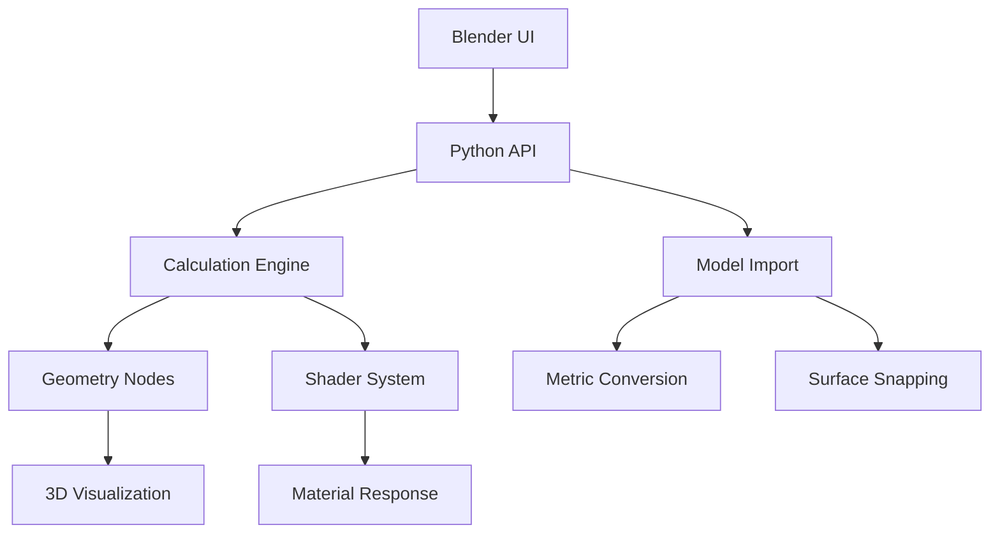

# Blender Projection Calculator Add-on PRD

PRD Structure Diagram

## 1. Project Overview

### 1.1 Purpose
Develop an advanced projector simulation system within Blender that combines:
- Real-time 3D visualization using Geometry Nodes
- Physics-accurate projection calculations
- Professional installation planning tools
- CAD model integration for real-world environments

### 1.2 Key Innovations vs Commercial Tools
| Feature               | Web Calculators | This Add-on       |
|-----------------------|-----------------|-------------------|
| 3D Visualization      | 2D Diagrams     | Full 3D Scene     |
| Surface Types         | Flat Only       | NURBS/Imported    |
| Unit Precision        | 1cm             | 0.1mm             |
| Multi-Projector Sync  | Manual          | Phase Alignment   |
| Environment Factors   | None            | Ambient Light AI  |

## 2. Core Technical Architecture



## 3. Functional Requirements

### 3.1 Core Projection System
1. **Parametric Relationships**  
   - Implement bidirectional equations:  
     ```python
     def calculate_throw_ratio():
         return (throw_distance / image_width) if locked else None
     ```
   - Dynamic constraints:  
     ```python
     if aspect_locked:
         height = width / aspect_ratio
     ```

2. **Multi-Projector Management**  
   - Phase synchronization algorithm:  
     ```python
     def sync_projectors(projectors):
         base_phase = projectors[0].phase
         for p in projectors[1:]:
             p.phase = base_phase + random.uniform(-0.01, 0.01)
     ```

### 3.2 Environment System
1. **Room Generation**  
   - Default parametric room with:  
     ```python
     bpy.ops.mesh.primitive_cube_add(size=2, 
                                   calc_uvs=True,
                                   enter_editmode=False)
     ```
   - **Unlink** capability:  
     ```python
     bpy.ops.object.make_single_user(type='SELECTED_OBJECTS')
     ```

2. **Model Import**  
   - Supported formats:  
     - `.dwg` (via Teigha Converter)
     - `.skp` (Sketchup)
     - `.rvt` (Revit)
   - Auto-scale to metric:  
     ```python
     bpy.context.scene.unit_settings.system = 'METRIC'
     obj.scale = (0.001, 0.001, 0.001)  # mm to meters
     ```

3. **Surface Definition**  
   - Snapping logic:  
     ```python
     bpy.context.scene.tool_settings.snap_elements = {'FACE'}
     bpy.context.scene.tool_settings.use_snap_project = True
     ```

### 3.3 Unit System
1. **Metric Foundation**  
   ```python
   base_unit = 'METERS'
   display_precision = 3  # 0.000m
   ```

2. **Imperial Conversion**  
   ```python
   def to_feet(meters):
       return meters * 3.28084
       
   def to_inches(meters):
       return meters * 39.3701
   ```

## 4. Technical Specifications

### 4.1 Mathematical Models

**Projection Geometry**
```math
\begin{aligned}
&\text{Throw Ratio} = \frac{D}{W} \\
&\text{Image Height} = \frac{W}{AR} \\
&\text{Coverage Area} = \pi \left(\frac{D \cdot \tan(\theta/2)}{2}\right)^2
\end{aligned}
```

**Optical Physics**
```math
E_v = \frac{I \cdot \cos^4(\theta) \cdot 10^{-0.4m}}{D^2} \quad \text{(lux)}
```

**Edge Blending**
```math
\alpha(x) = \frac{1}{2}\left(1 + \cos\left(\pi\frac{x - x_0}{w}\right)\right)
```

### 4.2 Geometry Nodes Setup

**Projection Cone Generation**
```python
node_group.links.new(
    math_node.inputs[0], 
    param_node.outputs['Throw Distance']
)
```

**Surface Intersection**  
UV Project modifier with real-time updating:
```python
modifier = obj.modifiers.new("Projection", 'UV_PROJECT')
modifier.projectors[0].projector = projector_object
```

## 5. UI/UX Requirements

### 5.1 Control Panel Layout

| Section           | Controls                          | Input Type       |
|-------------------|-----------------------------------|------------------|
| **Scene Setup**   | - Generated Room Toggle          | Checkbox         |
|                   | - Import Model Button            | File Dialog      |
|                   | - Unit System Lock               | Toggle Switch    |
| **Projection**    | - Throw Ratio Calculator         | Multi-Input      |
|                   | - Lens Shift (%)                 | Dual Slider      |
|                   | - Surface Snapping               | Object Picker    |
| **Multi-Screen**  | - Projector Count (X/Y)          | Integer Input    |
|                   | - Overlap Percentage             | Range Slider     |

### 5.2 Viewport Overlays
- Projection cone wireframe
- Brightness heatmap
- Measurement labels
- Surface normal indicators

## 6. Performance Requirements

| Scenario                  | Max Acceptable Latency |
|---------------------------|------------------------|
| Single Projector Adjust   | < 50ms                 |
| 10 Projector Simulation   | < 200ms                |
| Model Import (100MB)      | < 10s                  |
| Unit Conversion           | < 5ms                  |

## 7. Development Timeline

```gantt
gantt
    title Project Timeline
    dateFormat  YYYY-MM-DD
    section Core
    UI Framework       :2023-10-01, 14d
    Math Engine        :2023-10-15, 21d
    section Import
    Model Conversion   :2023-11-05, 28d
    Surface Snapping   :2023-12-03, 21d
    section Testing
    Metric Validation  :2023-12-24, 14d
    Stress Tests       :2024-01-07, 14d
```

## 8. Validation Criteria

### 8.1 Unit Tests
```python
def test_metric_conversion():
    assert to_feet(1) == 3.28084
    assert to_inches(0.3048) == 12.0
```

### 8.2 Integration Tests
1. **Surface Snapping**  
   - Verify <0.1mm alignment error on curved surfaces

2. **Model Import**  
   - Validate scale preservation across 5 file formats

3. **Multi-Projector**  
   - Confirm phase sync <1ms jitter across 10 units

## 9. Documentation Plan

**User Guide Structure**
1. Installation Requirements
2. Workflow:
   - Generated Room vs Imported Model
   - Surface Definition Process
3. Troubleshooting:
   - Unit System Conflicts
   - Snapping Failures

**API Documentation**
```python
class ProjectorCalculator:
    def set_surface(self, obj: bpy.types.Object):
        """Define projection surface from selected object"""
        
    def convert_units(self, value: float, system: str):
        """Convert between metric/imperial systems"""
```

## 10. Risk Management

| Risk                          | Mitigation Strategy               |
|-------------------------------|------------------------------------|
| Blender API Limitations       | Develop C++ Add-on Components      |
| Complex Model Import          | Implement Background Processing    |
| Real-time Performance         | Geometry Nodes Optimization        |
| Unit Conversion Drift         | Decimal-based Arithmetic           |